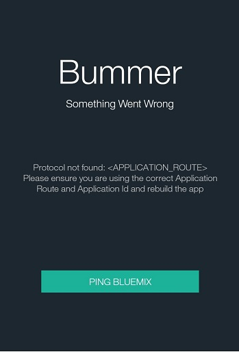

---

copyright:
  years: 2015-2016

---

<!-- Attribute definitions -->
{:codeblock: .codeblock}

# iOS용 Hello Bluemix 샘플 시작하기
{: #gettingstarted-android}
*마지막 업데이트 날짜: 2016년 6월 1일*
{: .last-updated}  

새 iOS 앱을 시작하려면 HelloWorld 앱을 사용할 수 있습니다. 이 앱에서는 인증 없이 모바일 앱에서 {{site.data.keyword.Bluemix}} 백엔드에 연결하는 방법을 예시합니다. 앱에는 이미 SDK가 설치되어 있습니다. 준비가 완료되면 사용자는 앱에서 사용할 특정 라이브러리를 가져올 수 있습니다.

1. {{site.data.keyword.Bluemix_notm}}에서 모바일 백엔드를 작성하십시오.
    1. {{site.data.keyword.Bluemix_notm}} 카탈로그의 표준 유형 섹션에서 MobileFirst Services 스타터를 클릭하십시오.
    2. 앱에 대한 이름 및 호스트를 입력하고 **작성**을 클릭하십시오.
    3. **완료**를 클릭하십시오.
2. GitHub에서 프로젝트를 가져오십시오. 선택에 따라 git clone 명령을 사용하여 프로젝트를 가져올 수도 있습니다. 컴퓨터에서 터미널을 열고, 다음 명령을 입력하십시오.
    ```
    git clone https://github.com/ibm-bluemix-mobile-services/bms-samples-ios-helloworld.git
    ```

3. 프로젝트를 초기화하십시오. SDK를 초기화하려면 Application Delegate의 `didFinishLaunchingWithOptions` 메소드에 다음 코드를 복사하십시오.

	###Ojbective-C
	{: initializeobjc}

	**중요**: Objective-C SDK가 완전히 지원되는 상태를 유지하고 여전히 {{site.data.keyword.Bluemix}} 모바일 서비스를 위한 기본 SDK로 간주되지만, 올해 후반부터는 새 Swift SDK를 지원하면서 이를 중단할 계획입니다.

	Objective-C SDK는 {{site.data.keyword.amashort}} 서비스의 모니터링 콘솔에 모니터링 데이터를 보고합니다. {{site.data.keyword.amashort}} 서비스의 모니터링 기능이 필요하면 계속해서 Objective-C SDK를 사용하십시오.

	```
	// initialize SDK with IBM Bluemix application ID and route
	IMFClient *imfClient = [IMFClient sharedInstance];
[imfClient initializeWithBackendRoute:@"<insert route>" backendGUID:@"<insertGUID>"];
return YES;
	```

	###Swift
	{: initializeswift}
	```
	// initialize SDK with IBM Bluemix application ID and route
	IMFClient.sharedInstance().initializeWithBackendRoute("<insert route>", backendGUID: "<insertGUID>")
	return true
	```

4. 개발 환경에서 샘플을 실행하십시오. Xcode에서 **Product&gt; Run**을 클릭하십시오. iOS 시뮬레이터가 시작됩니다.
5. 시뮬레이터에서 **Ping {{site.data.keyword.Bluemix_notm}}**를 클릭하십시오. 샘플 앱이 Mobile Client Access 서비스에서 권한 부여 헤더를 가져옵니다. ping 실행이 성공하면 시뮬레이터의 텍스트가 업데이트됩니다.

  Xcode의 모바일 앱에서 {{site.data.keyword.Bluemix_notm}}에 연결하면 다음 메시지가 표시됩니다. 

  `Yay! You are connected`
  {: screen}

  

  연결이 실패하면 다음 메시지가 표시됩니다.
  `Bummer. Something went wrong`
  {: screen}

  

	다음과 같이 실패한 연결의 문제점을 해결할 수 있습니다. 
	* 라우트 및 GUID 값을 올바로 붙여넣었는지 확인하십시오.
		####Objective-C
		{: #objcvals}
		```
		[imfClient initializeWithBackendRoute:@"https://hellotest.mybluemix.net"
		backendGUID:@"9d48d73a-0878-4254-test-bdcbe6c79c31"];
		```

		####Swift
		{: #swiftvals}
		```
		IMFClient.sharedInstance().initializeWithBackendRoute("https://hellotest.mybluemix.net", backendGUID: "9d48d73a-0878-4254-test-bdcbe6c79c31")
		```

	* 자세한 정보는 디버그 로그를 검토하십시오. 


## 다음 단계:
{: #next}
SDK를 가져와 모바일 앱에 통합하는 방법에 대한 정보는 Bluemix 서비스 설정에 대한 정보를 참조하십시오.
   * [Mobile Client Access](../../services/mobileaccess/index.html)
   * [Push](../../services/mobilepush/index.html)

# 관련 링크

## 샘플
   * [Hello Bluemix 샘플](https://github.com/ibm-bluemix-mobile-services/bms-samples-android-helloworld)

## SDK
   * [코어 SDK](https://github.com/ibm-bluemix-mobile-services/bms-clientsdk-android-core)

## API
   * [코어 API](https://www.{DomainName}/docs/api/content/api/mobilefirst/android/core-api-doc/overview-summary.html)
