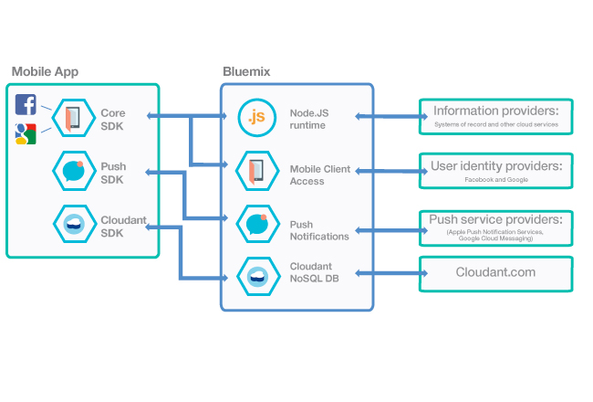

# Creating mobile apps from the {{site.data.keyword.mobilefirstbp}} Starter boilerplate
{: #try_mobile}
*Last Updated: 28 January 2016*
{: .last-updated} 

With {{site.data.keyword.Bluemix}} Mobile Services, you can incorporate pre-built, managed, and scalable cloud services into your mobile applications without relying on IT involvement. You can focus on building your mobile apps instead of the complexities of managing the back-end infrastructure.

<table><caption>Table 1. MobileFirst&trade; Services Starter boilerplate</caption>
<tr>
	<td>Each of the mobile services can be used independently. You can also use them together to get the most benefit. To get started, use the {{site.data.keyword.mobilefirstbp}} Starter to create your app. This boilerplate:
		<ul>
			<li>Creates a Node.js runtime with a template application. You can use this application to provide server-side functions, such as RESTful APIs and static files. <!-- You can read more about operating this application in the Developing Mobile Backend section.--> </li>
			<li>
Provisions an instance of each of the {{site.data.keyword.Bluemix_notm}} Mobile Services and binds the service to the  Node.js application. </li>
		</ul>
	</td>
	<td>  {{site.data.keyword.mobilefirstbp}} Starter boilerplate </td>
</tr>
</table>

After you use the {{site.data.keyword.mobilefirstbp}} Starter boilerplate to create your app, you can either get HelloWorld samples for each of the services or start instrumenting your existing app to use {{site.data.keyword.Bluemix_notm}} services.

## Services overview
{: #services-overview}
You can either use all of the {{site.data.keyword.Bluemix_notm}} Mobile Services together by using {{site.data.keyword.Bluemix_notm}} {{site.data.keyword.mobilefirstbp}} Starter boilerplate or you can use individual services from the {{site.data.keyword.Bluemix_notm}} catalog. The following diagram outlines all the components of {{site.data.keyword.Bluemix_notm}} Mobile Services.

<table>
<caption>Table 2. {{site.data.keyword.Bluemix_notm}} and enterprise systems</caption>
<th>{{site.data.keyword.Bluemix_notm}}</th>
<th>Enterprise systems</th>
<tr>
<td> <b>Node.js</b>   A Node.js runtime that hosts a template app is provided as part of the {{site.data.keyword.mobilefirstbp}} Starter boilerplate. You can use the template application to provide server-side functions, such as RESTful APIs and static files.  For example, you might extend the Node.js application for custom logic processing or to connect with REST APIs in your company's existing infrastructure. Each app that you create on {{site.data.keyword.Bluemix_notm}} has a unique app ID. Your mobile app uses this ID with the SDK to access the services that are associated with that application. The app ID is used by the platform as the context for common functions, such as metering and logging.
You can read more about operating this application in the "Developing Mobile Backend" section.</td>
<td valign="top"><b>Information providers</b>  You can use a Node.js runtime that is hosted on {{site.data.keyword.Bluemix_notm}} to connect to any kind of information provider:
<ul>
	<li>Enterprise backend</li>
	<li>Database </li>
	<li>Another hosted 3rd party service</li>
</ul>
</td>
</tr>
<tr>
<td> <b>{{site.data.keyword.amashort}}</b> Use the {{site.data.keyword.amafull}}  service to protect Node.js and Java for Liberty applications that are hosted on {{site.data.keyword.Bluemix_notm}}. By instrumenting your mobile app with the {{site.data.keyword.amashort}} SDK, you can require users to log in to access to Node.js or {{site.data.keyword.Bluemix_notm}} Mobile Services. In addition to security capabilities, {{site.data.keyword.amashort}} also gathers analytics data, so that you can monitor your mobile application performance and collect client logs and usage statistics. </td>
<td valign="top"><b>User identity providers</b>  You can use the following identity providers: <ul><li>Facebook</li><li>Google</li></ul></td>
</tr>
<tr>
<td> <b>{{site.data.keyword.mobilepushshort}}</b> The  {{site.data.keyword.mobilepushfull}} service provides a unified platform to send and manage mobile push notifications that are targeted to iOS and Android platforms. This service manages the mapping of your application users to their devices, device platform, and handles dispatching push notifications to the devices. With this service, you can send broadcasts, unicasts (based on userID, deviceID), and tags (or topics) based on push notifications to your mobile application users.</td>
<td valign="top"><b>Push service providers</b><ul><li>Apple Push Notifications Service</li><li>Google Cloud Messaging</li></ul></td>
</tr>
<tr>
<td><b>Cloudant NoSQLDB</b>  Cloudant is a NoSQL database as a service (DBaaS). It's built from the ground up to scale globally, run non-stop, and handle a wide variety of data types like JSON, full-text, and geospatial. </td>
<td>Cloudant.com</td>
</tr>
</table>
