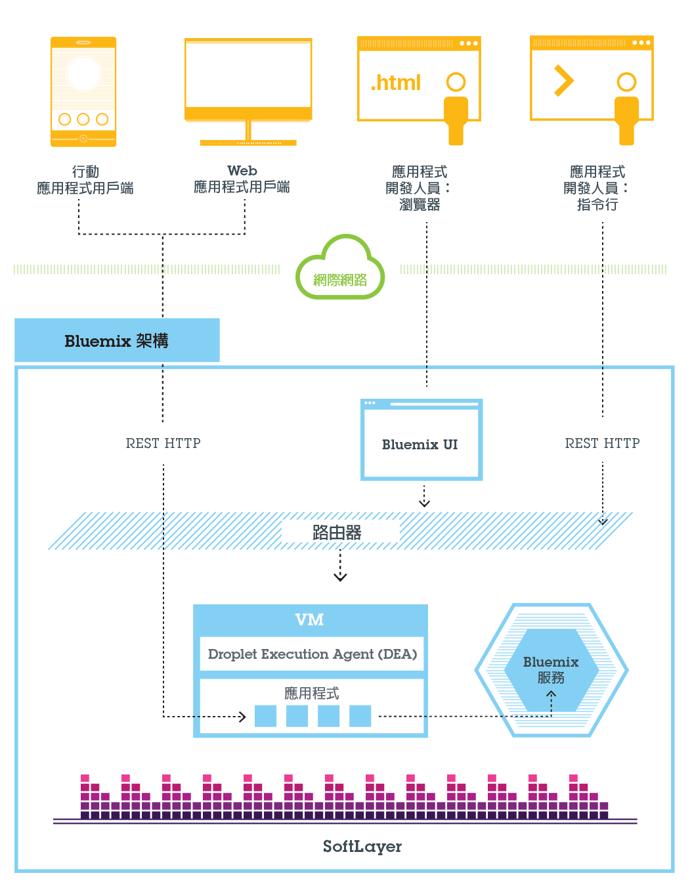
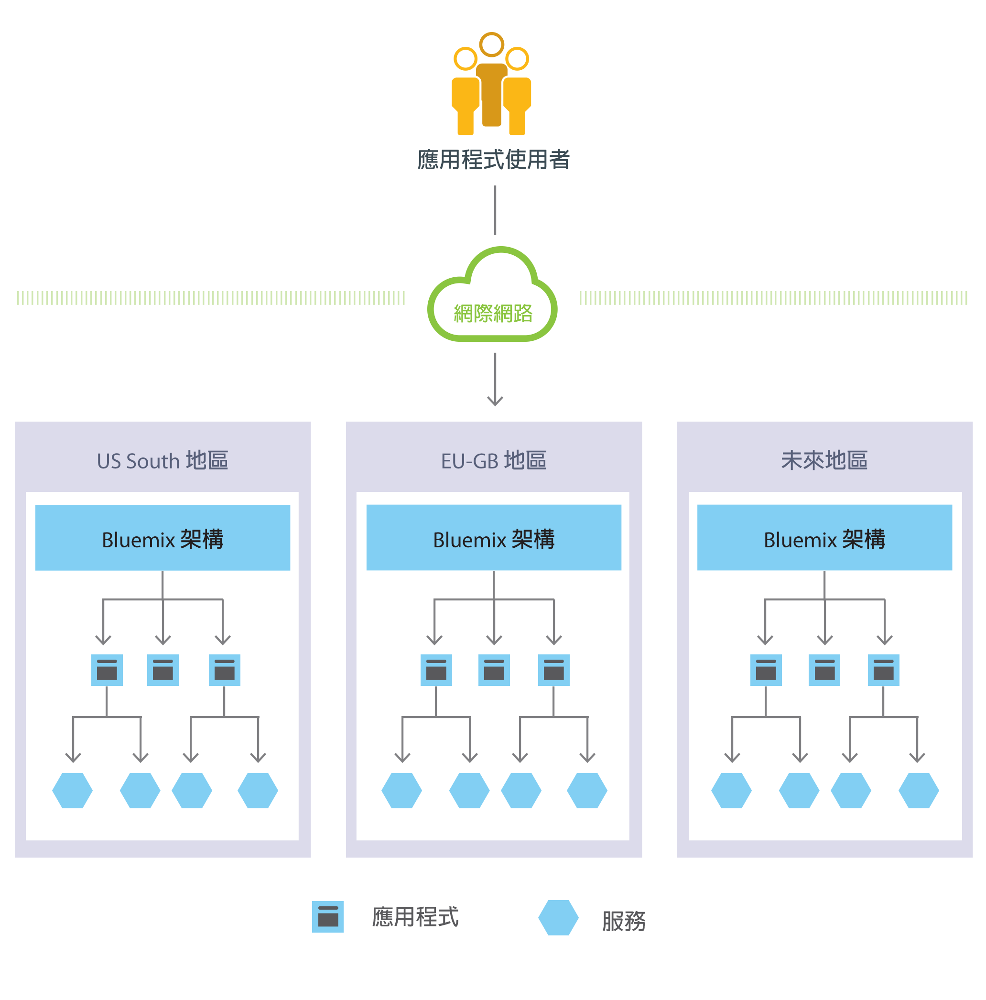
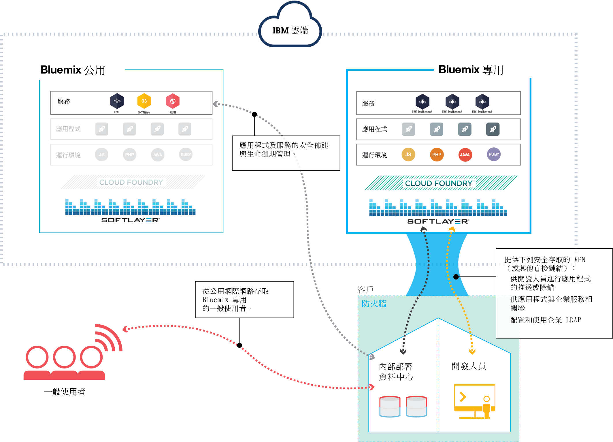
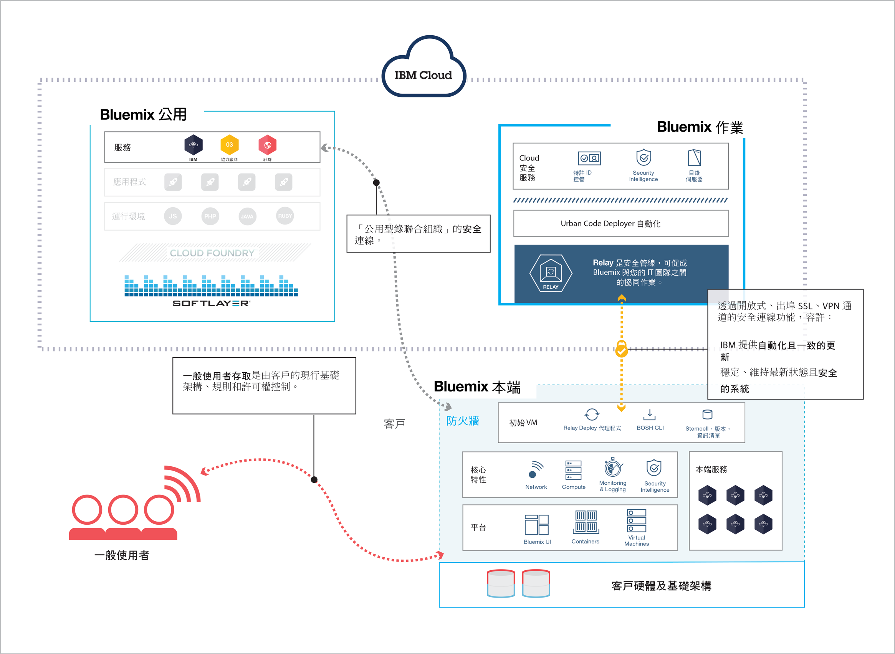
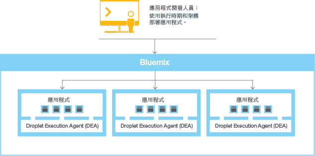
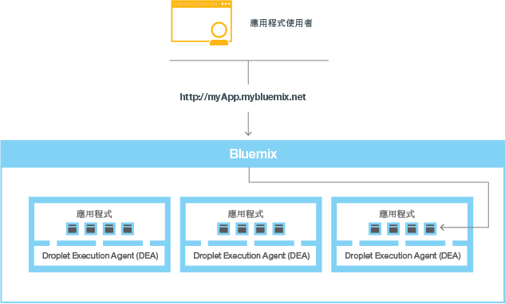

---

 

copyright:

  years: 2014, 2016

 

---

{:shortdesc: .shortdesc} 
{:new_window: target="_blank"}

# {{site.data.keyword.Bluemix_notm}} 概觀
{: #overview}

*前次更新：2016 年 5 月 9 日*
{: .last-updated}

{{site.data.keyword.Bluemix}} 是一種 {{site.data.keyword.IBM}} 開放雲端平台，提供 {{site.data.keyword.IBM_notm}} 軟體的存取權給行動和 Web 開發人員，以使用整合、安全、交易以及其他關鍵功能，還可以存取事業夥伴提供的軟體。
{:shortdesc}

以 [Cloud Foundry](https://www.cloudfoundry.org/){: new_window} 開放程式碼技術為建置基礎，{{site.data.keyword.Bluemix_notm}} 利用「平台即服務 (PaaS)」讓應用程式開發更為簡單。{{site.data.keyword.Bluemix_notm}} 也提供預先建置的「行動後端即服務 (MBaaS)」功能。目標是透過提供已經可立即使用的服務，以及啟用網際網路擴充開發的管理功能，來簡化應用程式的交付。

{{site.data.keyword.Bluemix_notm}} 也具有符合您需求的雲端部署。不論您是計劃擴充的小型企業，還是需要額外隔離的大型企業，都可以在雲端中自由地開發；在雲端，您可以將專用服務連接至 {{site.data.keyword.IBM_notm}} 及協力廠商提供者所提供的公用 {{site.data.keyword.Bluemix_notm}} 服務。所有服務實例都是由 {{site.data.keyword.IBM_notm}} 管理。您會收到一份帳單，且只需為您選擇使用的內容付費。

使用 {{site.data.keyword.Bluemix_notm}} 中廣泛的服務和運行環境集合，開發人員不但可獲得控制權和彈性，也能存取從預測分析到海量資料的各種資料選項。

{{site.data.keyword.Bluemix_notm}} 提供下列特性：

- 一系列服務，可讓您快速建置和延伸 Web 應用程式和行動應用程式。
- 強大的處理能力，以讓您連續地交付應用程式變更。
- 針對目標的程式設計模型和服務。
- 服務和應用程式可管理性。
- 最佳化的彈性工作負載。
- 持續可用性。

{{site.data.keyword.Bluemix_notm}} 可抽象化並隱藏與管理雲端型應用程式相關聯的大部分複雜事宜。身為應用程式開發人員，您可以將焦點放在開發應用程式，而不需要對管理該應用程式所需的基礎架構進行管理。對於行動及 Web 應用程式，您可以使用 {{site.data.keyword.Bluemix_notm}} 提供的預先建置服務。您可以將 Web 應用程式上傳至 {{site.data.keyword.Bluemix_notm}}，並指出要執行的實例數。部署應用程式之後，您可以在應用程式的用量或負載發生變化時，輕鬆地擴充或縮減應用程式。

您可以使用 {{site.data.keyword.Bluemix_notm}}，以最熱門的程式設計語言來快速開發應用程式。可以在 iOS、Android 和 HTML 中使用 JavaScript 來開發行動應用程式。對於 Web 應用程式，您可以使用 Ruby、PHP、Java&trade;、Go 及 Python 之類的語言。您也可以將現有應用程式移轉至 {{site.data.keyword.Bluemix_notm}}，以及使用 {{site.data.keyword.Bluemix_notm}} 提供以執行應用程式的運行環境。

{{site.data.keyword.Bluemix_notm}} 還提供應用中介軟體服務供應用程式使用。{{site.data.keyword.Bluemix_notm}} 會在佈建新服務實例並將這些服務連結到應用程式時，代表應用程式執行操作。您的應用程式可以執行實際的工作，並將服務的管理作業保留給基礎架構。

一般而言，您在 {{site.data.keyword.Bluemix_notm}} 上執行應用程式時不必擔心作業系統及基礎架構層。例如根檔案系統及中介軟體元件等層會抽象化，因此您可以專注於應用程式碼。不過，如果您需要應用程式執行位置的明確資訊，可以進一步瞭解這些層。如需詳細資料，請參閱[檢視 {{site.data.keyword.Bluemix_notm}} 基礎架構層](../cli/vcapsvc.html#viewinfra)。 

## {{site.data.keyword.Bluemix_notm}} 架構
{: #ov_arch}

使用 {{site.data.keyword.Bluemix_notm}}，您可以存取公用 {{site.data.keyword.Bluemix_notm}} 平台，以及（或）設定專用 {{site.data.keyword.Bluemix_notm}} 平台。

### {{site.data.keyword.Bluemix_notm}} 公用
{: #public}

基本上，{{site.data.keyword.Bluemix_notm}} 是一種環境，它讓您開發應用程式，以及使用可提供立即可用功能的服務。{{site.data.keyword.Bluemix_notm}} 還提供用於管理應用程式構件的環境，這些構件在應用程式伺服器（例如 Liberty）上執行。{{site.data.keyword.Bluemix_notm}} 透過利用 SoftLayer 來部署用於管理每一個已部署應用程式的虛擬容器。在此環境中，應用程式可以使用預先建置的服務（包括協力廠商服務）來輕鬆組合應用程式。

身為開發人員，您可以利用以瀏覽器為基礎的使用者介面，來與 {{site.data.keyword.Bluemix_notm}} 基礎架構互動。您也可以使用 Cloud Foundry 指令行介面（稱為 cf）來部署 Web 應用程式。

用戶端（可以是行動應用程式、外部執行的應用程式、以 {{site.data.keyword.Bluemix_notm}}
為建置基礎的應用程式，或使用瀏覽器的開發人員）可以與 {{site.data.keyword.Bluemix_notm}} 管理的應用程式互動。用戶端會使用 REST 或 HTTP API，透過 {{site.data.keyword.Bluemix_notm}} 將要求遞送到其中一個應用程式實例或複合式服務。

下圖顯示高階 {{site.data.keyword.Bluemix_notm}} 架構。



*圖 1. {{site.data.keyword.Bluemix_notm}} 架構*

基於延遲或安全考量，您可以將應用程式部署至不同的 {{site.data.keyword.Bluemix_notm}} 地區。您可以選擇部署至一個地區，或是部署至多個地區。如需相關資訊，請參閱[地區](#ov_intro__reg)。



*圖 2. 多地區應用程式部署*

### {{site.data.keyword.Bluemix_notm}} 專用
{: #dedicated}

「{{site.data.keyword.Bluemix_notm}} 專用」是您專用的 SoftLayer 環境，此環境同時安全地連接至公用 {{site.data.keyword.Bluemix_notm}} 及您自己的網路。「{{site.data.keyword.Bluemix_notm}} 專用」位於透過 VPN 或直接網路連線的網路。您的單一承租戶硬體可以設定於全球的任何 SoftLayer 資料中心。{{site.data.keyword.IBM_notm}} 會管理專用平台及專用服務，因此您可以專注於建置自訂應用程式。此外，{{site.data.keyword.IBM_notm}} 還會在您選取的維護時間範圍內，執行專用實例的所有維護。

{{site.data.keyword.IBM_notm}} 具有可用於您專用環境的數種服務，但您可以連接至所有公用服務。所有運行環境都可用於專用環境。{{site.data.keyword.Bluemix_notm}} 的所有專用部署都包括下列好處及特性，而且不需額外付費：VPN、專用 VLAN、防火牆、與 LDAP 的連線功能、利用現有內部部署資料庫及應用程式的能力、24 小時全年無休的現場安全防護、專用硬體及標準支援。 



*圖 3. {{site.data.keyword.Bluemix_notm}} 專用*

### {{site.data.keyword.Bluemix_notm}} 本端
{: #local}

「{{site.data.keyword.Bluemix_notm}} 本端」是您自己的 {{site.data.keyword.Bluemix_notm}} 實例，它部署在資料中心內，並受公司防火牆保護。使用「{{site.data.keyword.Bluemix_notm}} 本端」，您可以安全地連接「{{site.data.keyword.Bluemix_notm}} 公用」並與它同步。

「{{site.data.keyword.Bluemix_notm}} 本端」包含一份專用聯合型錄，它會顯示只供您使用的本端服務。它也包含來自「{{site.data.keyword.Bluemix_notm}}
公用」，用來形成聯合組織且可供您使用的服務。所有運行環境都可用於本端環境。{{site.data.keyword.Bluemix_notm}} 的本端部署包括下列好處及特性，而且不需額外付費：轉遞管理技術、與 LDAP 的連線功能、利用現有內部部署資料庫及應用程式的能力，以及標準支援。

IBM 使用轉遞技術來安全地監視及維護您的環境，讓您可以專注於事業。轉遞是「{{site.data.keyword.Bluemix_notm}} 本端」所含的交付功能，讓 IBM 能自動且一致地交付更新，讓您隨時擁有最新、穩定且安全的系統。轉遞會透過源自初始虛擬機器的開放式、出埠 SSL、VPN 通道來達成連線功能。透過此通道，IBM 可以為您的實例提供及維護平台、運算資源及服務。請參閱 [{{site.data.keyword.Bluemix_notm}} 本端](../local/index.html#local)。



*圖 4. {{site.data.keyword.Bluemix_notm}} 本端*

初始虛擬機器在客戶防火牆後面的網路中執行，該網路透過「轉遞」對 IBM 作業中心具有出埠連線功能。{{site.data.keyword.Bluemix_notm}} 平台元件和核心服務在一個隔離的專用虛擬區域網路 (VLAN) 中執行。「{{site.data.keyword.Bluemix_notm}} 本端」將 VLAN 用於專用子網路。使用專用子網路（而不使用公用 VLAN）不但更為安全，而且還有助於避免發生遞送問題。

DataPower 應用裝置提供對 {{site.data.keyword.Bluemix_notm}} 應用程式網域的存取。這些應用裝置會連接至可從您的內部網路存取的網路。部署應用程式及服務的使用者自可從您的內部網路存取的網路進行存取。您必須提供 7 個具有出埠網際網路存取權的 IP 位址。DataPower 應用裝置會從這些客戶 IP 位址遞送至隔離的 {{site.data.keyword.Bluemix_notm}} 部署。如需網路規格和基礎架構需求的相關資訊，請參閱 [{{site.data.keyword.Bluemix_notm}} 本端基礎架構需求](../local/index.html#localinfra)。

### {{site.data.keyword.Bluemix_notm}} 的運作方式
{: #howwork}

將某個應用程式部署至 {{site.data.keyword.Bluemix_notm}} 時，您必須使用足夠的資訊來配置 {{site.data.keyword.Bluemix_notm}}，才能支援該應用程式。

* 對於行動應用程式，{{site.data.keyword.Bluemix_notm}} 包含代表行動應用程式後端的構件，例如行動應用程式用來與伺服器進行通訊的服務。
* 對於 Web 應用程式，您必須確保將適當的運行環境和架構相關資訊傳遞給 {{site.data.keyword.Bluemix_notm}}，以讓它可以設定適當的執行環境來執行應用程式。

每一個執行環境（包括行動及 Web）都與其他應用程式的執行環境相隔離。即使這些應用程式位在相同的實體機器上，也一樣會隔離執行環境。下圖顯示 {{site.data.keyword.Bluemix_notm}} 如何管理應用程式部署的基本流程： 



*圖 5. 部署應用程式*

當您建立應用程式並將其部署至 {{site.data.keyword.Bluemix_notm}} 時，{{site.data.keyword.Bluemix_notm}} 環境會判定將應用程式或應用程式所代表的構件傳送到哪個適當的虛擬機器 (VM)。對於行動應用程式，將在 {{site.data.keyword.Bluemix_notm}} 上建立行動後端投射。在雲端中執行的行動應用程式的任何程式碼最終都會在 {{site.data.keyword.Bluemix_notm}} 環境中執行。對於 Web 應用程式，在雲端中執行的程式碼是開發人員部署至 {{site.data.keyword.Bluemix_notm}} 的應用程式本身。VM 的判定是根據數個因素，包括：

* 機器上已有的負載。
* 該 VM 支援的運行環境或架構。

選擇 VM 之後，每一個 VM 上的應用程式管理程式都會為應用程式安裝適當的架構及運行環境。然後，即可將應用程式部署至該架構。部署完成後，即會啟動應用程式構件。

下圖顯示已部署多個應用程式的 VM 結構（也稱為 Droplet Execution Agent，DEA）： 


*圖 6. VM 的設計*

在每一個 VM 中，應用程式管理程式都會與 {{site.data.keyword.Bluemix_notm}} 基礎架構的其餘部分進行通訊，並管理部署至此 VM 的應用程式。每一個 VM 都具有容器，用以隔離及保護應用程式。在每一個容器中，{{site.data.keyword.Bluemix_notm}} 會安裝每一個應用程式所需的適當架構及運行環境。

部署應用程式時，如果該應用程式具有 Web 介面（例如，Java Web 應用程式）或其他 REST 型服務（例如，向行動應用程式公開的行動服務），則應用程式的使用者就可利用正常的 HTTP 要求與其進行通訊。



*圖 7. 呼叫 {{site.data.keyword.Bluemix_notm}} 應用程式*

每一個應用程式都可以有一個以上的相關聯 URL，但是這些 URL 必須全部指向 {{site.data.keyword.Bluemix_notm}} 端點。要求到達時，{{site.data.keyword.Bluemix_notm}} 會檢查該要求、判斷其適用的應用程式，然後選取應用程式的其中一個實例來接收該要求。 

### {{site.data.keyword.Bluemix_notm}} 復原力
{: #resiliency}

{{site.data.keyword.Bluemix_notm}} 的設計旨在於管理可擴充、具復原力的應用程式及應用程式構件，這些應用程式與應用程式構件不僅可擴充以符合您的需要，還能維持高度可用性且可快速從問題中回復。{{site.data.keyword.Bluemix_notm}} 會隔開追蹤互動狀態的元件（有狀態）與不追蹤互動狀態的元件（無狀態）。這項分隔容許 {{site.data.keyword.Bluemix_notm}} 視需要彈性地移動應用程式，以達到可擴充性與復原力。

您的應用程式可以有一個以上的實例處於執行中狀態。一個應用程式有多個實例時，該應用程式只會上傳一次。不過，{{site.data.keyword.Bluemix_notm}} 會部署所要求的應用程式實例數，並將它們盡可能地分散在眾多 VM。

您必須將所有持續性資料儲存在應用程式之外的有狀態資料儲存庫，例如 {{site.data.keyword.Bluemix_notm}} 所提供的其中一個資料儲存庫服務上。因為記憶體中或磁碟上快取的任何內容可能無法使用（即使是重新啟動之後），所以您可以使用單一
{{site.data.keyword.Bluemix_notm}} 實例的記憶體空間或檔案系統，作為簡要的單一交易快取。使用單一實例設定，對您應用程式的要求可能會因為 {{site.data.keyword.Bluemix_notm}} 的無狀態本質而受到中斷。最佳作法是針對每個應用程式至少使用三個實例，以確保應用程式的可用性。

所有 {{site.data.keyword.Bluemix_notm}} 基礎架構、Cloud Foundry 元件及 {{site.data.keyword.IBM_notm}} 特有的管理元件都具有高可用性。使用基礎架構的多個實例來平衡負載。

## {{site.data.keyword.Bluemix_notm}} 概念
{: #ov_intro}

{{site.data.keyword.Bluemix_notm}} 包含應用程式、服務、建置套件及其他元件。您可以利用一個 {{site.data.keyword.IBM_notm}} ID，將應用程式部署至不同的 {{site.data.keyword.Bluemix_notm}} 地區。

### 地區
{: #ov_intro__reg}

{{site.data.keyword.Bluemix_notm}} 地區是您可以在其中部署應用程式的已定義地理區。您可以在不同地區建立應用程式及服務實例，使用相同
{{site.data.keyword.Bluemix_notm}} 基礎架構以進行應用程式管理，以及使用相同的用量詳細資料視圖來處理計費。您可以選取最接近客戶的地區，並將應用程式部署至此地區，以縮短應用程式的延遲時間。您也可以選取要保留應用程式資料的地區來處理安全問題。在多個地區中建置應用程式時，如果關閉某個地區，則位於其他地區中的應用程式會繼續執行。您使用的每個地區的資源額度都相同。

如果您使用的是 {{site.data.keyword.Bluemix_notm}} 使用者介面，則可以切換至不同地區，以使用該地區中的空間。

如果您使用的是 cf 指令行介面，則必須利用 cf api 指令以及指定地區的 API 端點，來連接至要使用的 {{site.data.keyword.Bluemix_notm}} 地區。例如，輸入下列指令以連接至 {{site.data.keyword.Bluemix_notm}} 歐洲英國地區：

```
cf api https://api.eu-gb.{{site.data.keyword.Bluemix_notm}}.net
```

如果您使用的是 Eclipse 工具，則必須建立 {{site.data.keyword.Bluemix_notm}} 伺服器並指定地區的 API 端點，來連接至要使用的 {{site.data.keyword.Bluemix_notm}} 地區。如需使用 Eclipse 工具的相關資訊，請參閱[使用 {{site.data.keyword.IBM_notm}} Eclipse Tools for {{site.data.keyword.Bluemix_notm}} 部署應用程式](../manageapps/eclipsetools/eclipsetools.html#toolsinstall)。

唯一字首會指派給每一個地區。{{site.data.keyword.Bluemix_notm}} 提供下列地區及地區字首。 

<!-- PRODUCTION ONLY: Ensure that URLs are production URLs, not stage1-->

| **地區名稱** | **地理位置** | **地區字首** | **cf API 端點** | **使用者介面主控台** |       
|-----------------|-------------------------|-------------------|---------------------|----------------|
| 美國南部地區 | 美國達拉斯 | ng | api.ng.bluemix.net | console.ng.bluemix.net |
| 英國地區 | 英國倫敦 | eu-gb | api.eu-gb.bluemix.net | console.eu-gb.bluemix.net |
| 雪梨地區 | 澳洲雪梨 | au-syd | api.au-syd.bluemix.net | console.au-syd.bluemix.net |


*表 1. {{site.data.keyword.Bluemix_notm}} 地區清單*

### 基礎架構
{: #infrastructure}

{{site.data.keyword.Bluemix_notm}} 提供三種執行程式碼的方式：Cloud Foundry、{{site.data.keyword.IBM_notm}} Containers 及 Virtual Machines。{{site.data.keyword.IBM_notm}} Containers 及 Virtual Machines 只能在美國南部及歐洲英國地區使用。您可以挑選用於部署應用程式的正確基礎架構。 

<dl>
<dt>Cloud Foundry</dt>
    <dd>Cloud Foundry 基礎架構中所執行的應用程式可與現有 Cloud Foundry 應用程式搭配運作，而且可以連結至 {{site.data.keyword.Bluemix_notm}}「型錄」中可用的任何服務。使用此基礎架構，您可以開發及管理應用程式碼，而且 {{site.data.keyword.Bluemix_notm}} 會負責管理及維護讓那些應用程式功能更強大的基礎架構。</dd>
<dt>{{site.data.keyword.IBM_notm}} Containers</dt>
    <dd>使用 {{site.data.keyword.IBM_notm}} Containers 基礎架構，您可以在支援容器部署的任何位置執行 Web 應用程式。*容器* 是一個物件，可保留應用程式執行所需的所有項目。此基礎架構包括信任映像檔的專用登錄，以便您可以上傳、儲存及擷取這些映像檔。然後，您可以在 {{site.data.keyword.Bluemix_notm}} 中使用那些映像檔，以及管理平台中的容器。{{site.data.keyword.IBM_notm}} Containers 基礎架構可進行水平及垂直擴充。您可以使用公用 Docker Hub 中提供的所有映像檔，以及使用 Docker API
及指令行介面來管理 {{site.data.keyword.Bluemix_notm}} 上的容器。{{site.data.keyword.IBM_notm}} 也在「Containers 登錄」中提供部分公用映像檔，您可以使用並擴充。
    {{site.data.keyword.IBM_notm}} Containers 用來在受管理的雲端環境中執行 Docker 容器。Docker 會新增引擎，該引擎會將應用程式部署至用於執行容器的虛擬環境。Docker 也提供可用來執行程式碼的環境。在您備妥時，會提供各種方法，讓您可以將程式碼從開發環境傳送至測試環境，然後再傳送至正式作業環境。

若要進一步瞭解 {{site.data.keyword.IBM_notm}} Containers，請參閱 [{{site.data.keyword.IBM_notm}} Containers](../containers/container_index.html)。</dd>
<dt>{{site.data.keyword.IBM_notm}} {{site.data.keyword.virtualmachinesshort}}（測試版）</dt>
    <dd><p>{{site.data.keyword.IBM_notm}} {{site.data.keyword.virtualmachinesshort}} 是受管理的雲端環境（{{site.data.keyword.IBM_notm}} {{site.data.keyword.Bluemix_notm}} 的一部分），可用來建置、執行、管理及監視應用程式，同時維護應用程式及其執行所在的中介軟體的最大控制權。{{site.data.keyword.virtualmachinesshort}} 可用來找出您的商業解決方案，特別是在公用雲端中部署應用程式時。</p>
<p>    
您可以在使用 OpenStack 軟體的公開和私密（內部部署）雲端中執行及管理虛擬伺服器。您可以使用 {{site.data.keyword.Bluemix_notm}} UI 或 OpenStackClient (OSC) 用戶端來建立、啟動及管理虛擬伺服器。您可以使用 {{site.data.keyword.IBM_notm}} 所提供的虛擬伺服器映像檔，或從您自己的自訂映像檔建立虛擬伺服器。您可以使用 {{site.data.keyword.IBM_notm}} {{site.data.keyword.Bluemix_notm}} 功能，來移除與管理雲端型應用程式相關聯的大部分複雜事宜（例如記載、自動擴充及監視）。您可以一起使用 OpenStack 服務與 {{site.data.keyword.Bluemix_notm}} 服務，以建置及執行混合式應用程式。您可以視需要根據作業原則及工作負載需求來佈建基礎架構資源。</p>
<p>
若要進一步瞭解 {{site.data.keyword.IBM_notm}} {{site.data.keyword.virtualmachinesshort}}，請參閱 [{{site.data.keyword.IBM_notm}} {{site.data.keyword.virtualmachinesshort}}](../virtualmachines/vm_index.html)。</p> </dd>
</dl>

### 應用程式
{: #applications}

在 {{site.data.keyword.Bluemix_notm}} 中，應用程式（或 *app*）代表開發人員正在建置的構件。{{site.data.keyword.Bluemix_notm}} 與 Cloud Foundry 中的應用程式生命週期完全相同，且與您將應用程式推送至 {{site.data.keyword.Bluemix_notm}} 的方式無關。如需相關資訊，請參閱[應用程式編譯打包方式](https://docs.cloudfoundry.org/concepts/how-applications-are-staged.html)。

<dl>
<dt>行動應用程式</dt>
    <dd>行動應用程式在 {{site.data.keyword.Bluemix_notm}} 環境之外執行，並使用已向其公開行動應用程式的服務。這些服務通常會採取一致的行動，且代表該應用程式的後端投射。在以容器為基礎的環境中，{{site.data.keyword.Bluemix_notm}} 還可以管理開發人員希望在後端伺服器上執行的應用程式碼。</dd>
<dt>Web 應用程式</dt>
    <dd>Web 應用程式包含需要在執行時執行或參照的所有程式碼。需要將 Web 應用程式上傳至 {{site.data.keyword.Bluemix_notm}}，才能管理應用程式。</dd>
</dl>

對於原始碼會編譯成運行環境二進位檔的語言（例如 Java），只需上傳二進位檔。

### 服務
{: #services}

*服務* 是一種由 {{site.data.keyword.Bluemix_notm}} 管理的雲端延伸。服務提供的功能可供應用程式的執行程式碼隨時使用。{{site.data.keyword.Bluemix_notm}} 提供的預先定義服務包括資料庫、傳訊、用於行動應用程式的推送通知，以及用於 Web 應用程式的彈性快取。

您可以在 {{site.data.keyword.Bluemix_notm}} 中建立自己的服務。這些服務的複雜性可能各不相同。它們可以是簡單的公用程式（例如，可在運行環境程式庫中看到的函數）。也可以是可在商業處理程序建模服務或資料庫中看到的複雜商業邏輯。

{{site.data.keyword.Bluemix_notm}} 會佈建新的服務實例，並將這些服務實例連結到應用程式，從而簡化服務的使用。服務的管理是由 {{site.data.keyword.Bluemix_notm}} 自動處理。如需 {{site.data.keyword.Bluemix_notm}} 中的所有可用服務，請參閱 {{site.data.keyword.Bluemix_notm}} 使用者介面中的型錄。

### 入門範本
{: #starters}

*入門範本* 是一種範本，其中包括預先定義的服務，以及利用特定建置套件進行配置的應用程式碼。有兩種類型的入門範本：樣板及運行環境。入門範本可以是用特定程式設計語言撰寫的應用程式碼，也可以是應用程式碼和一組服務的組合。

### 樣板
{: #boilerplates}

在 {{site.data.keyword.Bluemix_notm}} 中，*樣板* 包含應用程式及其關聯的運行環境，以及特定網域的預先定義服務。您可以使用樣板快速地開始運作。例如，您可以選取「行動雲」樣板來管理行動應用程式和 Web 應用程式，並利用行動應用程式範本及 SDK 來縮短伺服器端 Script 的開發時間。

### 運行環境
{: #runtimes}

*運行環境* 是用來執行應用程式的資源集。{{site.data.keyword.Bluemix_notm}} 會提供運行環境來作為不同類型應用程式的容器。運行環境會以建置套件的形式整合到 {{site.data.keyword.Bluemix_notm}} 中，並自動配置以供使用。

### 建置套件
{: #buildpacks}

建置套件是 Script 的集合，能準備您的程式碼以在目標 PaaS 上執行。建置套件會收集應用程式的運行環境及架構相依關係。然後，將它們與應用程式一起包裝成可以部署至雲端的 Droplet。

如果將應用程式部署至 {{site.data.keyword.Bluemix_notm}} 時未指定建置套件，則預設會使用內建建置套件。

<dl class="dl"><dt class="dt dlterm">內建 {{site.data.keyword.IBM_notm}} 建置套件</dt>
<dd class="dd"><div class="p">
<!-- begin PRODUCTION ONLY -->
下列清單是 {{site.data.keyword.IBM_notm}} 所建立的內建建置套件。
<ul>
<li>Liberty for Java</li>
<li>Node.js</li>
</ul>
<!-- end PRODUCTION ONLY -->
</div>
</div>
</dd>
<dt class="dt dlterm">內建社群建置套件</dt>
<dd class="dd"><p class="p">在 {{site.data.keyword.Bluemix_notm}} 中，您還可以使用 Cloud Foundry 社群所提供的內建建置套件。若要列出內建社群建置套件，請執行 <span class="keyword cmdname">cf buildpacks</span> 指令。</p>
</dd>
<dt class="dt dlterm">外部建置套件</dt>
<dd class="dd"><div class="p">如果在 {{site.data.keyword.Bluemix_notm}} 提供的內建建置套件中找不到所需的運行環境或架構，您可以裝載外部現有的建置套件，以供應用程式使用。外部建置套件是由 Cloud Foundry 社群提供，可用來作為您自己的建置套件。利用 <span class="keyword cmdname">cf push</span> 指令部署應用程式時，可指定建置套件。<div class="note note"><span class="notetitle">附註：</span>{{site.data.keyword.IBM_notm}} 不支援外部建置套件；因此，您可能需要與 Cloud Foundry 社群聯絡以取得支援。</div>
</div>
</dd>
</dl>


## 與記錄系統整合
{: #sor}

在雲端環境中，{{site.data.keyword.Bluemix_notm}} 可以透過連接以下兩個廣義種類的系統，來協助開發人員：記錄系統和參與系統。

*記錄系統* 包括用於儲存商業記錄及自動執行標準化處理程序的應用程式及資料庫。*參與系統* 是指延伸記錄系統的實用性並使其更吸引使用者的功能。透過整合記錄系統與在 {{site.data.keyword.Bluemix_notm}} 中建立的應用程式，您可以執行下列動作：

 * 透過下載並安裝內部部署的安全連接器，讓應用程式與後端資料庫之間能安全地通訊。
 * 以安全的方式呼叫資料庫。
 * 從含有資料庫及後端系統（例如客戶關係管理系統）的整合流程中建立 API。
 * 僅公開要向應用程式公開的綱目及表格。
 * {{site.data.keyword.Bluemix_notm}} 組織管理員可以將 API 發佈為只有組織成員才能看到的專用服務。

若要整合記錄系統與在 {{site.data.keyword.Bluemix_notm}} 中建立的應用程式，請使用 Cloud Integration 服務。利用 Cloud Integration 服務，您可以建立 Cloud Integration API 並將 API 發佈為組織的專用服務。

<dl>
<dt>Cloud Integration API</dt>
    <dd>使用 Cloud Integration API，可以透過 Web API 對位於防火牆後方的記錄系統進行安全存取。建立 Cloud Integration API 時，您可以選擇要透過 Web API 存取的資源、指定允許的作業，以及包括 SDK 和範例來存取 API。如需如何建立 Cloud Integration API 的相關資訊，請參閱[建立 Cloud Integration API](../services/CloudIntegration/index.html#cloudint_add_service)。</dd>
<dt>專用服務</dt>
    <dd>專用服務包含 Cloud Integration API、SDK 及授權原則。此外，專用服務可能包含來自服務提供者的文件或其他項目。只有組織管理員才能將 Cloud Integration API 發佈為專用服務。若要查看您可以使用的專用服務，請選取 {{site.data.keyword.Bluemix_notm}}「型錄」中的「專用」勾選框。您可以選取專用服務，並將其連結至應用程式，而不需要連接至 Cloud Integration 服務。將專用服務連結至應用程式的方式與其他 {{site.data.keyword.Bluemix_notm}} 服務相同。如需如何將 API 發佈為專用服務的相關資訊，請參閱「將 API 發佈為專用服務」。</dd>
</dl>

### 情境：建立複合的行動應用程式以與記錄系統相連接
{: #scenario}

{{site.data.keyword.Bluemix_notm}} 提供了一個平台，您可以在該平台中整合行動應用程式、雲端服務及企業記錄系統，以提供與內部部署資料互動的應用程式。

例如，您可以建置行動應用程式，與位於防火牆後內部部署的客戶關係管理系統互動。您可以透過安全的方式呼叫記錄系統，並運用 {{site.data.keyword.Bluemix_notm}} 中的行動服務，以建置複合的行動應用程式。

首先，整合開發人員會在 {{site.data.keyword.Bluemix_notm}} 中建立行動後端應用程式。他會使用「行動雲」樣板，該樣板使用他最熟悉的 Node.js 運行環境。

然後，在 {{site.data.keyword.Bluemix_notm}} 使用者介面中利用 Cloud Integration 服務，透過安全連接器公開 API。整合開發人員會下載安全連接器，並以內部部署方式安裝它，以啟用其 API 與資料庫之間的安全通訊。建立資料庫端點之後，他可以查看所有綱目，並擷取要以 API 形式向應用程式公開的表格。

整合開發人員會新增 Push 服務，以提供行動通知給有興趣的客戶。此外，他還會新增事業夥伴服務，以在使用 Twitter API 建立新的客戶記錄後發佈推文。

接著，身為應用程式開發人員，您可以登入 {{site.data.keyword.Bluemix_notm}}，下載 Android 開發工具箱，然後開發用於呼叫整合開發人員所建立 API 的程式碼。您可以開發一個行動應用程式，讓使用者可以在其行動裝置上輸入資訊。接著，行動應用程式會在客戶管理系統中建立客戶記錄。建立記錄後，該應用程式會向行動裝置推送通知，並開始一則關於新記錄的推文。

## {{site.data.keyword.Bluemix_notm}} 的國家語言支援
{: #lang}

{{site.data.keyword.Bluemix_notm}} 支援英文以外的國家語言。不過，{{site.data.keyword.Bluemix_notm}} 隨附的所有內容並未全部翻譯。下表列出 {{site.data.keyword.Bluemix_notm}} 支援的國家語言及語言碼。

| **國家語言** | **語言碼** |
|-------------------|---------------|
| 巴西葡萄牙文 | pt_BR |
| 英文 | en |
| 法文 | fr |
| 德文 | de |
| 日文 | ja |
| 韓文 | ko |
| 義大利文 | it |
| 西班牙文 | es |
| 簡體中文 | zh_CN |
| 繁體中文 | zh_TW |

*表 2. 支援的國家語言及語言碼*

# 相關鏈結
{: #rellinks}

## 相關鏈結
{: #general}

* [{{site.data.keyword.Bluemix_notm}} 必要條件](https://developer.ibm.com/bluemix/support/#prereqs)
* [{{site.data.keyword.Bluemix_notm}} 新增功能](../whatsnew/index.html)
* [{{site.data.keyword.Bluemix_notm}} 已知問題](https://developer.ibm.com/bluemix/support/#issues)
* [{{site.data.keyword.Bluemix_notm}} 名詞解釋](glossary/index.html)
* [{{site.data.keyword.Bluemix_notm}} 定價單](https://console.{DomainName}/pricing/)
* [{{site.data.keyword.Bluemix_notm}}DevOps Services](https://hub.jazz.net)
* [Cloud Foundry](http://cloudfoundry.org/)
* [SoftLayer（{{site.data.keyword.IBM_notm}} 旗下的一家公司）](http://www.softlayer.com/)
