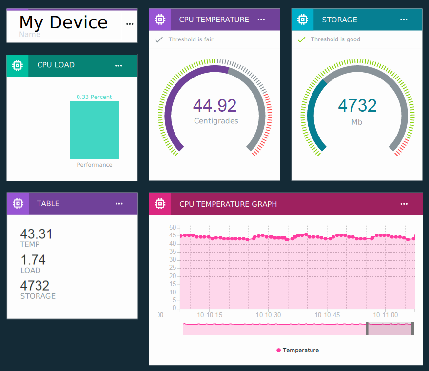

---

copyright:
  years: 2016

---

{:new_window: target="_blank"}
{:shortdesc: .shortdesc}
{:screen: .screen}
{:codeblock: .codeblock}
{:pre: .pre}

# Viewing real-time data with dashboard cards
Create boards and cards to create and share your own dashboards that visualize your device data in real time.
{:shortdesc}

By using boards and cards, you can graphically visualize data set values from one or more devices for quick overview and understanding. Create boards and add cards that display the data as raw numbers, real-time graphs, gauges, and more. Add members to your boards to share them with other users in your organization. Arrange the cards and add explanatory text dividers to fine-tune your presentation.  

## Visualizing the real-time message payload data
{{site.data.keyword.iot_full}} provides a built-in dashboard that you can use to display the real-time data that your device is returning. By default, the Overview page displays usage information about your {{site.data.keyword.iot_short_notm}} organization, such as data and the storage space that is consumed. To see real-time device data as it flows in, add device-specific cards to this page.
To add a device-specific card to a board:
1. In the {{site.data.keyword.iot_short_notm}} dashboard, select **Boards**.
2. Select a board that you have editing rights for or create a new board.
3. In the board, click **Add New Card**.
2. In the Edit Generic Visualization Card box, scroll down to the Devices section.
3. Select a visualization type.
**Tip:** Select **Generic visualization** to proceed with a basic configuration. You can change the card type later.
Click **Show more** for the full list of card types.
4.	Select one or more card data sources and then click **Next** to add one or more data sets.
 1.	Give the data set an identifying name.
 2. Select an event that includes the data point that you want to display.
 3.	Select the property that represents the data point.
 4.	Set the type, unit, precision, and minimum and maximum values for the data point.  
 When you are done you can click **New Data Set** to add more data sets, or click **Next**.
5.	Select the visualization to use.
Select the type and size of visualization that you want to use.  Some card types have more settings.
<table>
<thead>
<tr>
<th>Type</th>
<th>Data that is displayed</th>
</tr>
</thead>
<tbody>
<tr>
<td>Generic visualization</td>
<td>The value of one or more data sets.  **Tip:** To see up to three data point values in a small table, choose the large widget size.  </td>
</tr>
<tr>
<td>Realtime chart</td>
<td>One or more data sets in a real-time scrolling chart. Use the Settings menu to set data range and retention, set the look and feel of the graphs, and more. </td>
</tr>
<tr>
<td>Bar chart</td>
<td>Data set values in labeled bars. Use the Settings menu to toggle horizontal or vertical bar direction.</td>
</tr>
<tr>
<td>Donut chart</td>
<td>Two or more data sets in a circular representation.</td>
</tr>
<tr>
<td>Value</td>
<td>The raw value of one or more data sets.</td>
</tr>
<tr>
<td>Gauge</td>
<td>The value of a data set as a gauge. You can configure display thresholds for good, fair, and critical values of the data set. Use the Settings menu to optionally set gauge thresholds for lower, middle, and upper data ranges.  </td>
</tr>
</tbody>
</table>

6.	Provide a title and a description for the card and optionally, select a color scheme, then click **Submit** to create the card.
7.	Finally, position the new card on your board by dragging it to a good location.  

Great! You can now see the real-time data of your device!
