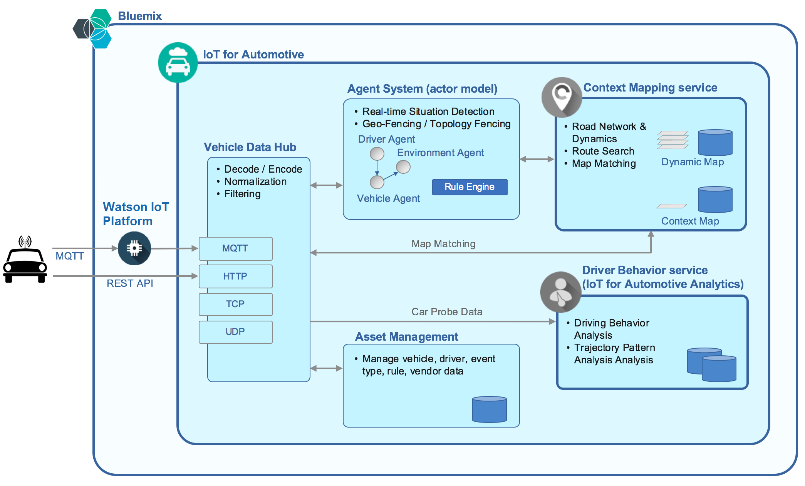

---

copyright:
  years: 2016

---

{:new_window: target="_blank"}
{:shortdesc: .shortdesc}

# About {{site.data.keyword.iot4auto_short}} (Experimental)
{: #iotautomotive_overview}

*Last updated: 23 June 2016*
{: .last-updated}

{{site.data.keyword.iot4auto_full}} is a service on {{site.data.keyword.Bluemix_notm}} that you can use to view and analyze big data from vehicles.

By using the {{site.data.keyword.iot4auto_short}} service, you can collect and process large volumes of data from vehicles. The analytics of {{site.data.keyword.iot4auto_short}} provide powerful and actionable insights into driver behavior, vehicle location, and other automotive-related activities and events of interest.
{:shortdesc}

## Architecture
{: #architecture}
{{site.data.keyword.iot4auto_short}} is a foundational real-time infrastructure platform for automotive applications and connected vehicle devices. The service is also designed to support the emerging autonomous driving capabilities of the future.

The {{site.data.keyword.iot4auto_short}} service includes the following {{site.data.keyword.Bluemix_notm}} services, which are also separately available in the {{site.data.keyword.Bluemix_notm}} catalog:

|Service|Description|
|:---|:---|
|[Driver Behavior](../IotDriverInsights/index.html)| A service that can analyze the driver behavior and identify trajectory patterns of a journey from the car probe and context data that is retrieved from a connected vehicle.
|[Context Mapping](../IotMapInsights/index.html)| A service that provides geospatial functions, such as map matching and shortest path search for road networks.

## Features
{: #features}

{{site.data.keyword.iot4auto_short}} supports the following features and functions for solutions that provide car probe data from connected vehicle devices:

### Data retrieval from {{site.data.keyword.iot4auto_short}} devices

- Supports the following protocols and data models:
   - TPEG
   - ITS
   - ISO automotive standards
- Supports other non-vehicle devices and sensors

### Data normalization and storage

- Identifies and filters anomaly data
- Maps, converts, and formats data to the standard data model for analysis
- Puts data in one of the following data stores according to the volume, latency, and usage of the application or service:
   -  Hadoop data store for big data analysis
   -  Agent data store for real-time analysis

### Geospatial map based service

- Real-time map matching
- Event service
- Dynamic event injection from vehicles and external sources
- Link or node-based topology aware searching
- Contextual map support that has integrated weather data

### Highly scalable and low-latency real-time analysis platform

- Agent-based technology
- Personalized analysis
- Flexible rule-based analysis

### Moving Object Map Analysis (MOMA)

- Batch (big data) analysis by using data from the vehicle
- Driver Behavior Analysis
- Driver Profiling
- Trajectory Pattern Analysis

### Data provider service

- APIs for third-party applications and services

### Integration with asset management

- Vehicle asset management systems

## REST API
{: #api}

The [{{site.data.keyword.iot4auto_short}} API](http://ibm.biz/IoT4Automotive_APIdoc) provides commands to help you to develop {{site.data.keyword.iot4auto_short}} further to meet your requirements.

By using the available REST API commands, you can customize your {{site.data.keyword.iot4auto_short}} service instance:

- Inject specific events into the system
- Store the normalized car probe data from a vehicle in the preferred analytics data store
- Retrieve the events of interest in real time together with the geographic location of the vehicle

### REST API commands

|Goal |API command |Description |
|:---|:---|:---|
|Inject event|`sendEvent`|Sends the traffic or other events to the platform.|
|Send car probe data|`sendCarProbe`|Sends the position-based sensor data from the vehicle and retrieves the affected events for the vehicle by the result of real-time analysis.|
|Create vehicle data|`createVehicle`|Create a record of the vehicle as an asset. This information is used for authentication, inventory, and other uses.|
|Map APIs|Not applicable|For more information, see the [Contextual Map service APIs](http://ibm.biz/IoTContextMapping_APIdoc).|
|Analysis APIs|Not applicable|For more information, see the [Driver Behavior service APIs]( http://ibm.biz/IoTDriverBehavior_APIdoc).|
|Get car probe data|`getCarProbe`|Gets the latest car probe data of the vehicle that was sent by the `sendCarProbe` API command.|
|Get map events|`getEvent` |Gets the events on the map that were sent by the `sendEvent`  API command.|
|Get vehicle asset data|`getVehicle`| Gets the vehicle data as an asset from the `createVehicle` API command.|
