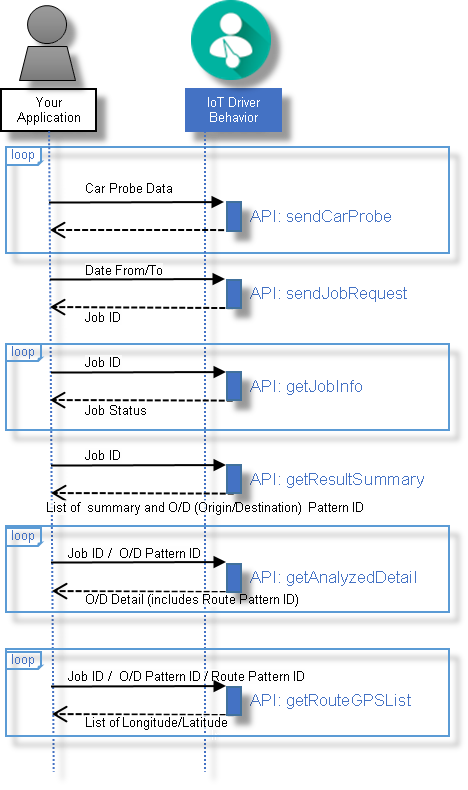

---

copyright:
  years: 2016

---

{:new_window: target="_blank"}
{:shortdesc: .shortdesc}
{:screen: .screen}
{:codeblock: .codeblock}
{:pre: .pre}

# Getting started with Trajectory Pattern Analysis
{: #tp_index}
*Last updated: 16 June 2016*
{: .last-updated}

Trajectory Pattern Analysis API is a service within the {{site.data.keyword.Bluemix_notm}}   {{site.data.keyword.iotdriverinsights_full}} service that you can use to analyze the Origin/Destination (O/D) and route patterns of driving trips from car probe data.

{:shortdesc}

The following diagram outlines a typical sequence of API calls in Trajectory Pattern Analysis:

After you create and deploy {{site.data.keyword.iotdriverinsights_short}} as an unbound service instance, complete the following tasks to integrate your applications with the Trajectory Pattern Analysis API.

## Before you begin
{: #tp_byb}
- Review the [About Trajectory Pattern Analysis](tp_iotdriverinsights_overview.html) topic to familiarize yourself with the analyzable behaviors and contexts.
- Get the automatically generated *Tenant ID*, *Username*, and *Password* values, which are required to access the {{site.data.keyword.iotdriverinsights_short}} API:

  1. From the {{site.data.keyword.Bluemix_notm}} dashboard, click the {{site.data.keyword.iotdriverinsights_short}} service tile.
  2. Select the **Manage** view of your service instance.
  3. Make a note of the tenant ID, user name, and password values.

## Task 1: Uploading vehicle data
{: #tp_task1}
Upload multiple sets of driving trip data to your  {{site.data.keyword.iotdriverinsights_short}} tenant to make the driver data available for Trajectory Pattern Analysis.

1. Send car probe data to the store to be analyzed with the `sendCarProbeData` API.  
Upload your car probe data to {{site.data.keyword.iotdriverinsights_short}}.
   - Request: Car probe data

## Task 2: Processing vehicle data
{: #tp_task2}

Process the vehicle data to analyze O/D (Origin/Destination) pattern and route pattern

1. Send a job request to analyze car probe data over a certain time period with the `sendJobRequest` of Trajectory Pattern Analysis API.
   - Request: Date from and to
   - Response: Job ID
2. Check the job status with the `getJobInfo` of Trajectory Pattern Analysis API.  
The data processing is complete when the job status returned states 'SUCCEEDED'. You can now request trajectory pattern analysis result data.
   - Request: Job ID
   - Response: Job status

## Task 3: Analyze trips
{: #tp_task3}
Analyze trips from a specific date range to understand how they conform to the analysis threshold parameters.

1. To get the analyzed (Origin/Destination) pattern summary list, use the `getResultSummary` of Trajectory Pattern Analysis API.  
The O/D pattern summary list includes analyzed trip summary information according to the input parameters:
   - Request: Job ID
   - Response: List of  summary and O/D (Origin/Destination), pattern ID
2. To get the detailed analyzed O/D pattern and route pattern information, use the the `getAnalyzedDetail` of Trajectory Pattern Analysis API command.  
Get the detailed trajectory pattern information for analyzed trips.
   - Request: Job ID /  O/D Pattern ID
   - Response: Details of O/D (includes Route Pattern ID)
3. To retrive a list of GPS points of each route pattern, use the `getRouteGPSList` of Trajectory Pattern Analysis API.  
Finally, get the list of GPS points of a specific route pattern.
   - Request: Job ID /  O/D Pattern ID / Route Pattern ID
   - Response: List of Longitude/Latitude of a route pattern

## Next steps
{: #tp_post}
When you complete the steps, a set of analyzed trajectory pattern data is generated in your organization.  Use your applications or your preferred analytics software to process the information further into more meaningful business data.

# Related Links
{: #rellinks}

## API reference
{: #api}

* [API docs](http://ibm.biz/IoTDriverBehavior_APIdoc){:new_window}

## Other resources
{: #general}

* [Getting started with {{site.data.keyword.iotmapinsights_short}}](../IotMapInsights/index.html){:new_window}
* [Getting started with {{site.data.keyword.iot_full}}](https://www.ng.bluemix.net/docs/services/IoT/index.html){:new_window}
* [dW Answers on IBM developerWorks](https://developer.ibm.com/answers/topics/iot-driver-behavior){:new_window}
* [Stack Overflow](http://stackoverflow.com/questions/tagged/iot-driver-behavior){:new_window}
* [What's new in Bluemix Services](http://www.ng.bluemix.net/docs/whatsnew/index.html#services_category){:new_window}
