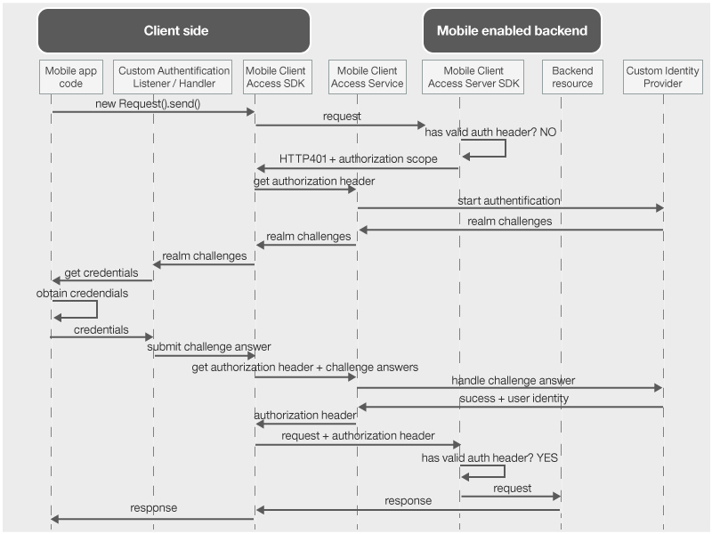

---

copyright:
  years: 2015, 2016

---

# Authenticating users with a custom identity provider
{: #custom-id}

*Last updated: 07 July 2016*
{: .last-updated}


Create a custom identity provider and implement your own logic for collecting and validating credentials. A custom identity provider is a web application that exposes a RESTful interface. You can host the custom identity provider on premises or on {{site.data.keyword.Bluemix}}. The only requirement is that the custom identity provider must be accessible from the public internet so that it can communicate with the {{site.data.keyword.amashort}} service.

## {{site.data.keyword.amashort}} custom identity provider overview
{: #custom-id-ovr}
 The following diagram demonstrates how {{site.data.keyword.amashort}} integrates a custom identity provider.



1. Use the {{site.data.keyword.amashort}} SDK to make a request to your back-end resources that are protected with {{site.data.keyword.amashort}} server SDK.
* The {{site.data.keyword.amashort}} server SDK detects an unauthorized request and returns HTTP 401 and the authorization scope.
* The {{site.data.keyword.amashort}} client SDK automatically detects the above HTTP 401 and starts the authentication process.
* The {{site.data.keyword.amashort}} client SDK contacts the {{site.data.keyword.amashort}} service and requests an authorization header.
* The {{site.data.keyword.amashort}} service communicates with the custom identity provider in order to start authentication process.
* The custom identity provider returns an authentication challenge to the {{site.data.keyword.amashort}} service.
* The {{site.data.keyword.amashort}} service returns the authentication challenge to the {{site.data.keyword.amashort}} client SDK.
* The {{site.data.keyword.amashort}} client SDK delegates authentication to a custom class that you created. You are responsible for collecting credentials and supplying the credentials back to {{site.data.keyword.amashort}} client SDK.
* After the developer has supplied credentials to {{site.data.keyword.amashort}} SDK the credentials will be sent to {{site.data.keyword.amashort}} service as an authentication challenge answer.
* The {{site.data.keyword.amashort}} service validates authentication challenge answer with the custom identity provider.
* If validation is successful, the {{site.data.keyword.amashort}} service generates an authorization header and returns it to the {{site.data.keyword.amashort}} client SDK. The authorization header contains two tokens: an access token that contains access permissions information and ID token that contains information about current user, device, and application.
* From this point on, all requests made with the {{site.data.keyword.amashort}} client SDK have a newly obtained authorization header.
* The {{site.data.keyword.amashort}} client SDK automatically resends the original request that triggered the authorization flow.
* The {{site.data.keyword.amashort}} server SDK extracts authorization header from the request, validates it with the {{site.data.keyword.amashort}} service, and grants access to a back-end resource.

## Understanding custom identity providers
{: #custom-id-about}

With a custom identity provider, you can supply custom authentication challenges to be sent to the client. You can fully customize the authentication flow.

When you create a custom identity provider, you might:

1. Customize an authentication challenge to be sent by the {{site.data.keyword.amashort}} service to the mobile or web client application. An authentication challenge is a JSON object that contains any custom data. The client can use this custom data to customize authentication flows.

  Example of a custom authentication challenge:

	```JavaScript
	{
		status: "challenge",
		challenge: {
			message:"Enter username and password",
			retriesLeft: 2,
			minUsernameLenth: 8
		}
	}
	```

1. Implement any custom credentials collection flow on the client, including multi-step and multi-form authentication. Similarly to the custom authentication challenge, you must design the structure of a custom authentication challenge answer.

  Example of a custom authentication challenge answer sent by the client:

	```JavaScript
	{
		username:"bob.smith",
		password:"abcd1234",
		pincode:"1234"
	}
	```
1. Implement custom logic of validating supplied authentication challenge answer.

1. Define a custom user identity object that contains any required custom properties. here is an example of a custom user identity object that is obtained by client after successful authentication:

	```JavaScript
	{
		username:"bob.smith",
		displayName:"Bob Smith",
		attributes:{
			age: 30,
			accountNumber: 12345,
			lastLogin: "Sept 1st, 2015"
		}
	}
	```

### Sample implementation of custom identity provider
{: #custom-sample}
Use any of the following Node.js sample implementations of a custom identity provider as a reference when you develop your custom identity provider. Download full application code from the GitHub repositories.

 * [Simple sample](https://github.com/ibm-bluemix-mobile-services/bms-mca-custom-identity-provider-sample)
 * [Advanced sample](https://github.com/ibm-bluemix-mobile-services/bms-mca-custom-identity-provider-with-user-management)

## Typical communication between {{site.data.keyword.amashort}} server and a custom identity provider
{: #custom-id-comm}

1. The {{site.data.keyword.amashort}} service sends a `startAuthorization` request to the custom identity provider.
1. The custom identity provider responds with a custom authentication challenge to be sent to the client.
1. The {{site.data.keyword.amashort}} service sends the custom authentication challenge that is received from custom identity provider to the client, and eventually receives an authentication challenge answer from the client.
1. The {{site.data.keyword.amashort}} service sends a `handleChallengeAnswer` request with the authentication challenge answer to custom identity provider.
1. The custom identity provider verifies the authentication challenge answer, and responds with a success response, containing the user identity information.
1. Optionally, the custom identity provider might provide more challenges after receiving a challenge answer from the client. Sending multiple challenges allows for a multi-step authentication process.

## Stateful versus stateless
{: #custom-id-state}
By default, the custom identity provider is considered a stateless application. In some cases, the custom identity provider might need to store state that is related to the authentication process. An example use case is a multi-step authentication, where the custom identity provider needs to store the result of the first authentication step, before proceeding to the next step. To support stateful functionality, a custom identity provider must generate a stateID and supply it in the  response to the {{site.data.keyword.amashort}} service. The {{site.data.keyword.amashort}} service must pass the stateID in subsequent requests that belong to the client authentication process.

## Custom realm
{: #custom-id-custom}

A custom identity provider supports one custom authentication realm. To handle incoming authentication challenges, create, and register an instance of `AuthenticationDelegate`/ `AuthenticationListener` in your client application. Define the custom authentication realm name when you configure a custom identity provider in the {{site.data.keyword.amashort}} dashboard. The realm identifies the  specific {{site.data.keyword.amashort}} service instance of an incoming request.

## Next steps
{: #next-steps}
* [Creating a Custom Identity Provider](custom-auth-identity-provider.html)
* [Configuring {{site.data.keyword.amashort}} for custom authentication](custom-auth-config-mca.html)
* [Configuring custom authentication for Android](custom-auth-android.html)
* [Configuring custom authentication for iOS (Swift SDK)](custom-auth-ios-swift-sdk.html)
* [Configuring custom authentication for iOS (Objective-C SDK)](custom-auth-ios.html)
* [Configuring custom authentication for Cordova](custom-auth-cordova.html)

