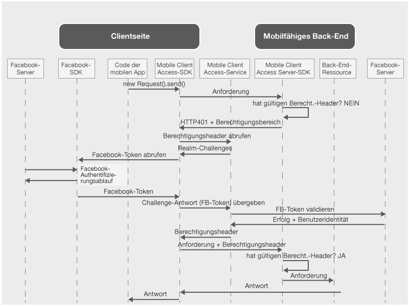

---

copyright:
  years: 2015, 2016

---
{:new_window: target="_blank"}
{:shortdesc: .shortdesc}
{:screen: .screen}
{:codeblock: .codeblock}

# Benutzer mit Facebook-Berechtigungsnachweisen authentifizieren
{: #facebook-auth-overview}

*Letzte Aktualisierung: 15. Juni 2016*
{: .last-updated}

Sie können den {{site.data.keyword.amashort}}-Service zum Schutz von Ressourcen unter Verwendung von Facebook als Identitätsprovider konfigurieren. Die Benutzer Ihrer mobilen Anwendung können ihre Facebook-Berechtigungsnachweise für die Authentifizierung nutzen.
{:shortdesc}

**Wichtig**: Sie müssen das von Facebook bereitgestellte SDK nicht separat installieren. Das Facebook-SDK wird automatisch durch Abhängigkeitenmanager installiert, wenn Sie das {{site.data.keyword.amashort}}-Client-SDK konfigurieren.

## {{site.data.keyword.amashort}}-Anforderungsablauf
{: #mca-facebook-sequence}

Im folgenden vereinfachten Diagramm wird die Integration von {{site.data.keyword.amashort}} in Facebook für die Authentifizierung veranschaulicht.

1. Verwenden Sie das {{site.data.keyword.amashort}}-Client-SDK, um eine Anforderung an Ihre Back-End-Ressourcen zu senden, die mit dem {{site.data.keyword.amashort}}-Server-SDK geschützt werden.
* Das {{site.data.keyword.amashort}}-Server-SDK erkennt eine nicht autorisierte Anforderung und gibt den Code HTTP 401 sowie den Berechtigungsbereich zurück.
* Das {{site.data.keyword.amashort}}-Client-SDK erkennt den Code HTTP 401 automatisch und startet den Authentifizierungsprozess.
* Das {{site.data.keyword.amashort}}-Client-SDK kontaktiert den {{site.data.keyword.amashort}}-Service und fordert die Ausgabe eines Berechtigungsheaders an.
* Der {{site.data.keyword.amashort}}-Service fordert den Client auf, sich zuerst bei Facebook durch die Bereitstellung einer Authentifizierungsanforderung (Challenge) zu authentifizieren.
* Das {{site.data.keyword.amashort}}-Client-SDK verwendet das Facebook-SDK, um den Authentifizierungsprozess zu starten. Nach einer erfolgreichen Authentifizierung gibt das Facebook-SDK ein Facebook-Zugriffstoken zurück.
* Das Facebook-Zugriffstoken wird als Antwort auf die Authentifizierungsanforderung (Challenge) betrachtet. Das Token wird an den {{site.data.keyword.amashort}}-Service gesendet.
* Der Service validiert die Antwort auf die Authentifizierungsanforderung mit Facebook-Servern.
* Wenn die Validierung erfolgreich ist, generiert der {{site.data.keyword.amashort}}-Service einen Berechtigungsheader und gibt diesen an das {{site.data.keyword.amashort}}-Client-SDK zurück. Der Berechtigungsheader enthält zwei Tokens: ein Zugriffstoken, das Informationen zu Zugriffsberechtigungen enthält, und ein ID-Token, das Informationen zum aktuellen Benutzer, zum Gerät und zur Anwendung enthält.
* Von diesem Punkt an haben alle Anforderungen, die durch das {{site.data.keyword.amashort}}-Client-SDK gesendet werden, einen neu abgerufenen Berechtigungsheader.
* Das {{site.data.keyword.amashort}}-Client-SDK wiederholt automatisch das Senden der ursprünglichen Anforderung, die den Berechtigungsablauf ausgelöst hat.
* Das {{site.data.keyword.amashort}}-Server-SDK extrahiert den Berechtigungsheader aus der Anforderung, validiert ihn mit dem {{site.data.keyword.amashort}}-Service und erteilt den Zugriff auf eine Back-End-Ressource.

## Facebook-Anwendungs-ID vom Facebook-Entwicklerportal anfordern
{: #facebook-appID}

Zur Verwendung von Facebook als Identitätsprovider müssen Sie eine Anwendung im Facebook-Entwicklerportal erstellen. Bei diesem Prozess erhalten Sie eine Facebook-Anwendungs-ID, bei der es sich um eine eindeutige Kennung handelt, an der Facebook erkennt, welche Anwendung versucht, eine Verbindung herzustellen.

1. Öffnen Sie das [Facebook-Entwicklerportal](https://developers.facebook.com).

1. Klicken Sie auf **My Apps** im obersten Menü und wählen Sie die Option **Create a new app** aus.
Wenn die Auswahl zwischen einer iOS-Anwendung oder einer Android-Anwendung angeboten wird, wählen Sie eine dieser Optionen aus und klicken Sie auf **Skip and Create App ID** auf der nächsten Anzeige.

1. Legen Sie den Anzeigenamen der Anwendung nach Ihrer Wahl fest und wählen Sie eine Kategorie aus. Klicken Sie auf **Create App ID**, um fortzufahren.

1. Kopieren Sie den angezeigten Wert für **App ID**. Dieser Wert ist Ihre Facebook-Anwendungs-ID.  Sie benötigen diesen Wert, um die Facebook-Authentifizierung für Ihre mobile App zu konfigurieren.

## Nächste Schritte
{: #next-steps}

* [Facebook-Authentifizierung für Android-Apps aktivieren](facebook-auth-android.html)
* [Facebook-Authentifizierung für iOS-Apps aktivieren (Swift-SDK)](facebook-auth-ios-swift-sdk.html)
* [Facebook-Authentifizierung für iOS-Apps aktivieren (Objective-C-SDK - nicht mehr verwendet)](facebook-auth-ios.html)
* [Facebook-Authentifizierung für Cordova-Apps aktivieren](facebook-auth-cordova.html)
