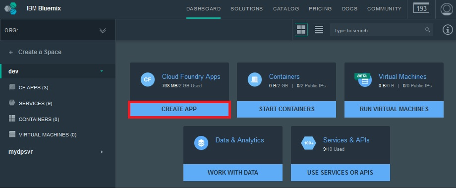
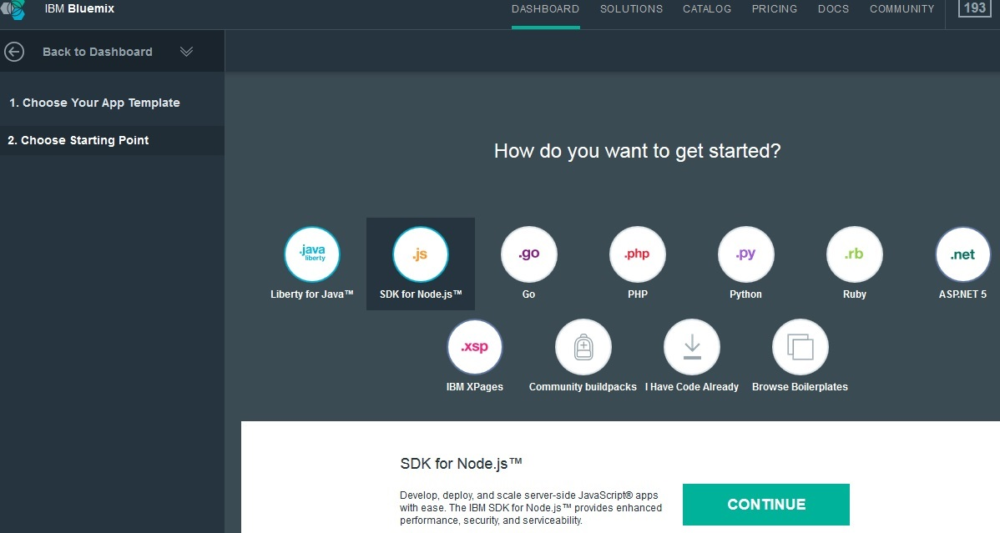
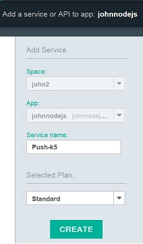
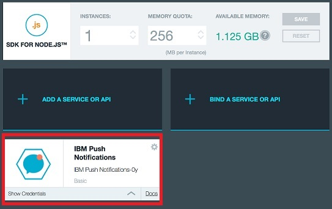

---

Copyright :
  Années : 2015, 2016

---

# Création d'une instance de service push
{: #create-push-instance}

Avant d'utiliser {{site.data.keyword.IBM}} {{site.data.keyword.mobilepushshort}}, vous devez créer une application {{site.data.keyword.Bluemix}} ; par exemple, une appli Node.js. Ensuite, vous créez une instance d'un service Push, {{site.data.keyword.mobilepushfull}}, qui doit être liée à cette application Bluemix. Pour ce faire, vous pouvez aussi accéder à la section Conteneurs boilerplate du catalogue Bluemix et cliquer sur MobileFirst Services Starter.

**Remarque** : Si vous avez configuré vos organisations pour qu'elles gèrent votre environnement, sélectionnez l'organisation dans laquelle créer le contexte
d'exécution et les services pour votre application mobile.

1. Si vous ne disposez pas d'une application Bluemix, vous devez en créer une, par exemple, une appli Node.js. Pour créer une application Bluemix,
accédez au tableau de bord Bluemix et cliquez sur **Créer une appli**.
	
	**Remarque** : Si vous disposez d'une application, passez à l'étape 7 pour ajouter un service.

1. Depuis **Choix de votre modèle d'application**, cliquez sur **WEB**.

3. Dans la zone **Choix du point de départ**, sélectionnez **SDK for Node.js**, puis cliquez sur **CONTINUER**.. 

4. Dans le menu déroulant **Espace**, sélectionnez l'espace de votre organisation.

	
1. Dans la zone **Nom**, entrez le nom de votre application et dans la zone Hôte, entrez le nom de l'hôte.

1. Dans le menu déroulant **Plan sélectionné**, sélectionnez un plan, puis cliquez sur le bouton **CREER**. Attendez que l'application soit constituée.

1. Cliquez sur le lien **Vue d'ensemble**.
1. Cliquez sur **Ajouter un service**. L'écran CATALOGUE s'affiche.

1. Sélectionnez **IBM Push Notifications** et depuis le menu déroulant **Espace**, sélectionnez votre organisation.

	
1. Dans la zone **Nom du service**, entrez le nom du service Notification push.

1. Dans le menu **Plan sélectionné**, sélectionnez un plan et cliquez sur le bouton **CREER**.

1. Cliquez sur **Oui** pour reconstituer l'application.

	

1. Cliquez sur **Notifications push** pour afficher le tableau de bord de notification push.
