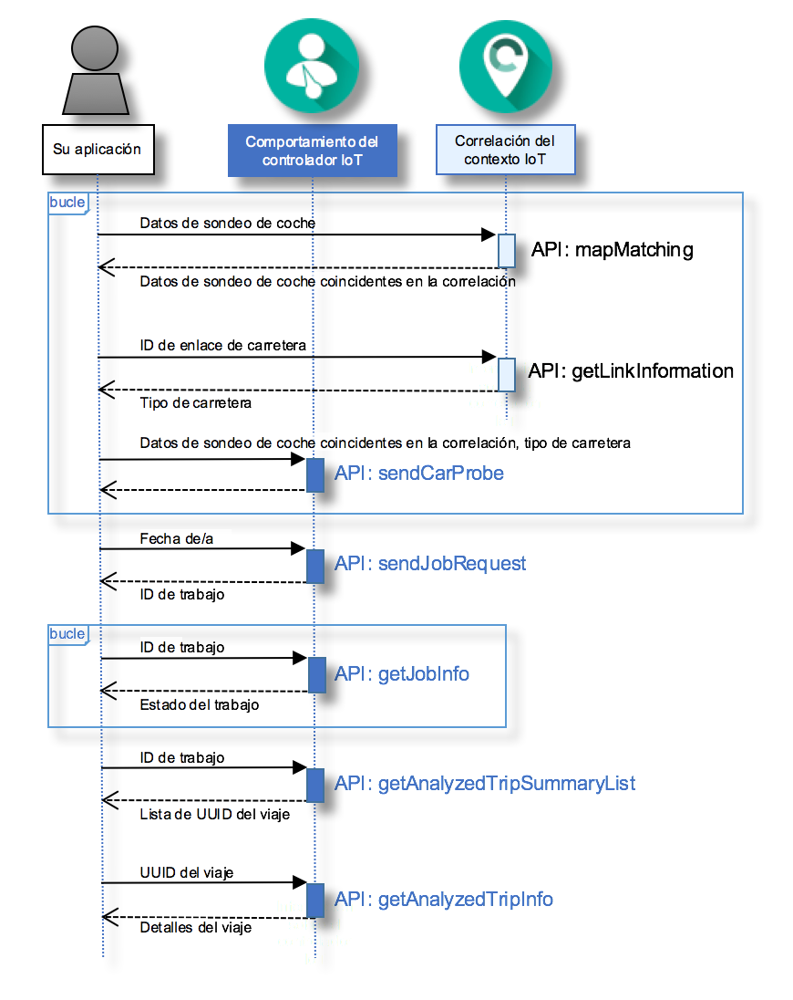

---

copyright:
  years: 2016

---

{:new_window: target="_blank"}
{:shortdesc: .shortdesc}
{:screen: .screen}
{:codeblock: .codeblock}
{:pre: .pre}

# Introduzione a {{site.data.keyword.iotdriverinsights_short}}
{: #gettingstartedtemplate}
*Ultimo aggiornamento: 13 maggio 2016*

Con {{site.data.keyword.iotdriverinsights_full}}, puoi eseguire delle attività di analisi sul comportamento del guidatore utilizzando l'API {{site.data.keyword.iotdriverinsights_short}} per raccogliere e analizzare i dati di analisi delle vetture e i dati di contesto.
{:shortdesc}

Attieniti alla seguente procedura per integrare la tua applicazione con l'API {{site.data.keyword.iotdriverinsights_short}} dopo che hai creato e distribuito un'istanza del servizio non associata. 

1. (Facoltativo) Prima di inviare i dati di analisi delle vetture all'API {{site.data.keyword.iotdriverinsights_short}}, puoi
aggiungere degli ulteriori dati ad essi utilizzando l'API {{site.data.keyword.iotmapinsights_short}}.
     - Ottieni i dati di analisi delle vetture messi in corrispondenza con la mappa utilizzando l'API `mapMatching`.
        - [Richiesta] dati di analisi delle vetture
        - [Risposta] Dati di analisi delle vetture messi in corrispondenza con la mappa
     - Ottieni i dati sul tipo di strada utilizzando l'API `getLinkInformation`.
        - [Richiesta] ID collegamento stradale
        - [Risposta] Tipo di strada
2. Invia i dati di analisi delle vetture da archiviare e da analizzare utilizzando l'API `sendCarProbe`.
   - [Richiesta] Dati di analisi delle vetture messi in corrispondenza con la mappa e tipo di strada
3. Invia una richiesta lavoro per analizzare i dati di analisi delle vetture utilizzando l'API `sendJobRequest`.
   - [Richiesta] Data (da e a)
   - [Risposta] ID lavoro
4. Controlla lo stato del lavoro utilizzando l'API `getJobInfo`.
   - [Richiesta] ID lavoro
   - [Risposta] Stato lavoro
5. Ottieni l'elenco di riepilogo dei viaggi analizzati utilizzando l'API `getAnalyzedTripSummaryList`.
   - [Richiesta] ID lavoro
   - [Risposta] Elenco di riepilogo del viaggio analizzato
6. Ottieni informazioni dettagliate sul viaggio analizzato utilizzando l'API `getAnalyzedTripInfo`.
   - [Richiesta] UUID viaggio
   - [Risposta] Dettagli del viaggio analizzato 

Il seguente diagramma di sequenza mostra la sequenza dei passi.

Consulta l'argomento [Informazioni su {{site.data.keyword.iotdriverinsights_short}}](iotdriverinsights_overview.html) per i dettagli sui comportamenti e i contesti analizzabili.
Utilizza [{{site.data.keyword.iotmapinsights_short}} / {{site.data.keyword.iotdriverinsights_short}} - Esercitazione parte 1](https://github.com/IBM-Bluemix/car-data-management){:new_window} per provare un'applicazione di esempio con dati di analisi dei veicoli di esempio.

# Link correlati
{: #rellinks}
## Esercitazioni ed esempi
{: #samples}

* [{{site.data.keyword.iotmapinsights_short}} / {{site.data.keyword.iotdriverinsights_short}} - Esercitazione parte 1](https://github.com/IBM-Bluemix/car-data-management){:new_window}
* [{{site.data.keyword.iotmapinsights_short}} / {{site.data.keyword.iotdriverinsights_short}} - Esercitazione parte 2](https://github.com/IBM-Bluemix/map-driver-insights){:new_window}

## Guida di riferimento API
{: #api}

* [Documenti API](http://ibm.biz/IoTDriverBehavior_APIdoc){:new_window}

## Link correlati
{: #general}

* [Introduzione a {{site.data.keyword.iotmapinsights_short}}](../IotMapInsights/index.html){:new_window}
* [Introduzione a {{site.data.keyword.iot_full}}](https://www.ng.bluemix.net/docs/services/IoT/index.html){:new_window}
* [dW Answers su IBM developerWorks](https://developer.ibm.com/answers/topics/iot-driver-behavior){:new_window}
* [Stack Overflow](http://stackoverflow.com/questions/tagged/iot-driver-behavior){:new_window}
* [What's new in Bluemix Services](http://www.ng.bluemix.net/docs/whatsnew/index.html#services_category){:new_window}

