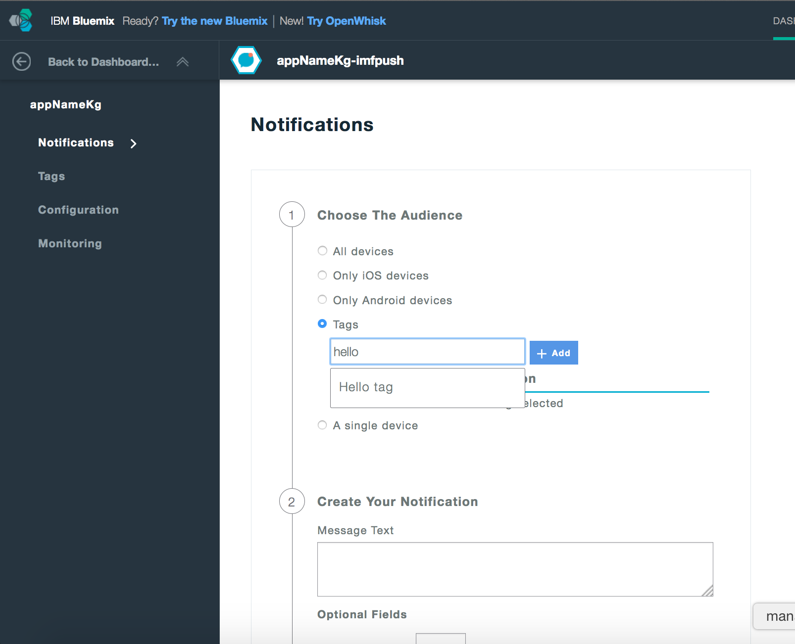
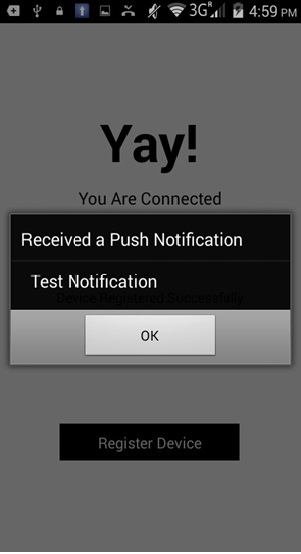

---

copyright:
 years: 2015, 2016

---

# 使 iOS 应用程序能够接收推送通知
{: #enable-push-ios-notifications}

使 iOS 应用程序能够接收推送通知，并向您的设备发送推送通知。


##安装 CocoaPods
{: #enable-push-ios-notifications-install}

对于现有 Xcode 项目，可以使用 CocoaPods 依赖关系管理工具来设置 Bluemix Mobile Services 客户机 SDK。替代方法是手动安装该 SDK。

**注**：要查看 Swift Push 自述文件，请转至 https://github.com/ibm-bluemix-mobile-services/bms-clientsdk-swift-push/tree/master


1. 在 Mac 终端中，使用以下命令安装 CocoaPods：

```
$ sudo gem install cocoapods
```
2. 在终端中输入以下命令来初始化 CocoaPods。发出此命令时，确保此命令是在 Xcode 项目所在目录中运行。`pod init` 命令会创建文件标题。
  
```
$ pod init
```
3. 在生成的 Podfile 中，添加所需的 SDK 依赖关系。复制以下 Podfile。

   Objective-C

    ```
    source 'https://github.com/CocoaPods/Specs.git'
	Copy the following list as is and remove the dependencies you do not need
	pod 'IMFCore'
	pod 'IMFPush'
	```

   Swift

	```
	source 'https://github.com/CocoaPods/Specs.git'
	// Copy the following list as is and remove the dependencies you do not need.
	use_frameworks!

	target 'MyApp' do
	    platform :ios, '8.0'
	    pod 'BMSCore'
	    pod 'BMSPush'
      pod 'BMSAnalyticsAPI'
	end
	```
3. 在终端中，转至项目文件夹，然后使用以下命令安装依赖关系：

```
$ pod update
```
该命令会安装依赖关系并创建新的 Xcode 工作空间。**注**：确保始终打开新的 Xcode 工作空间，而不是原始 Xcode 项目文件：
```
	$ open App.xcworkspace
	```
该工作空间包含原始项目，以及包含依赖关系的 Pods 项目。如果要修改 Bluemix Mobile Services 源文件夹，您可以在 Pods 项目的 `Pods/yourImportedSourceFolder` 下找到该文件夹，例如：`Pods/BMSPush`。

##Carthage
{: #carthage}

使用 [Carthage](https://github.com/Carthage/Carthage#if-youre-building-for-ios-tvos-or-watchos) 将框架添加到项目中。（https://github.com/Carthage/Carthage#if-youre-building-for-ios-tvos-or-watchos%29。）

1. 将 `BMSPush` 框架添加到 Cartfile 中：
```
github "github "ibm-bluemix-mobile-services/bms-clientsdk-swift-push" ~> 1.0"
```
2. 运行 `carthage update` 命令。构建完成时，请将 `BMSPush.framework`、`BMSCore.framework` 和 `BMSAnalyticsAPI.framework` 拖动到 Xcode 项目中。
3. 遵循 [Carthage](https://github.com/Carthage/Carthage#if-youre-building-for-ios-tvos-or-watchos) 站点上的指示信息以完成集成。

##使用导入的框架和源文件夹

在代码中引用 SDK。


### Objective-C

针对相关头编写 #import 伪指令，例如：

```
//Objective-C
#import <IMFCore/IMFCore.h>
#import <IMFPush/IMFPush.h>
```

**注**：使用 CocoaPods 命令 `pod install` 或 `pod update` 更新 Pods 项目可能会覆盖 Bluemix Mobile Services 源文件夹。如果要保留原始文件的定制版本，请确保在发出其中某个命令之前已备份这些文件。

###Swift

**先决条件**

- iOS 8.0 或更高版本
- Xcode 7


针对相关头编写 #import 伪指令，例如：

```
//swift
import BMSCore
import BMSPush
```
**注意**：要查看 Swift Push 自述文件，请转至[自述文件](https://github.com/ibm-bluemix-mobile-services/bms-clientsdk-swift-push/tree/master)
##构建设置

转至 **Xcode > 构建设置 > 构建选项**，然后将**启用位代码**设置为**否**。

**注意**：自 iOS 9 起，对应用程序传输安全性 (ATS) 功能的更改可能会影响您处理认证过程的方式。以下博客帖子描述了有关这些更改的更多信息：[ATS and Bitcode in iOS 9](https://developer.ibm.com/mobilefirstplatform/2015/09/09/ats-and-bitcode-in-ios9/) 和 [Connect your iOS 9 app to Bluemix today](https://developer.ibm.com/bluemix/2015/09/16/connect-your-ios-9-app-to-bluemix/)


## 为 iOS 应用程序初始化推送 SDK
{: #enable-push-ios-notifications-initialize}

在 iOS 应用程序中，通常会将初始化代码放置在应用程序代表中。单击 Bluemix 应用程序仪表板中的**移动选项**链接，以获取应用程序路径和 GUID。

###初始化核心 SDK

####Objective-C

```
// Initialize the SDK for Object-C with IBM Bluemix GUID and route
IMFClient *imfClient = [IMFClient sharedInstance];
[imfClient initializeWithBackendRoute:"add_your_applicationRoute_here" backendGUID:"add_your_appId_here"];
```

####Swift

```
// Initialize the Core SDK for Swift with IBM Bluemix GUID, route, and region
let myBMSClient = BMSClient.sharedInstance

myBMSClient.initializeWithBluemixAppRoute("BluemixAppRoute", bluemixAppGUID: "APPGUID", bluemixRegion:"Location where your app Hosted")
myBMSClient.defaultRequestTimeout = 10.0 // Timput in seconds
```


###初始化客户机推送 SDK

####Objective-C

```
//Initialize client Push SDK for Objective-C
IMFPushClient _pushService = [IMFPushClient sharedInstance];
```

####Swift

```
//Initialize client Push SDK for Swift
let push = BMSPushClient.sharedInstance
```

### 路径、GUID 和 Bluemix 区域

**appRoute**

指定分配给在 Bluemix 上创建的服务器应用程序的路径。

**GUID**

指定分配给在 Bluemix 上创建的应用程序的唯一键。此值区分大小写。

**bluemixRegionSuffix**

指定托管应用程序的位置。`bluemixRegion` 参数指定要使用的 Bluemix 部署。可以使用 `BMSClient.REGION` 静态属性设置此值，并使用以下三个值中的一个值：

- BMSClient.REGION_US_SOUTH
- BMSClient.REGION_UK
- BMSClient.REGION_SYDNEY


## 注册 iOS 应用程序和设备
{: #enable-push-ios-notifications-register}


应用程序必须注册 APNS，才能接收远程通知，该注册通常发生在将应用程序安装到设备上之后。当应用程序收到 APNS 生成的设备令牌后，必须将该令牌传递回 Push Notifications Service。

要注册 iOS 应用程序和设备，请执行以下操作：

1. 创建后端应用程序
2. 将令牌传递给 Push Notifications


###创建后端应用程序

在 Bluemix®“目录”的“样板”部分中创建后端应用程序，这会自动将该 Push 服务绑定到此应用程序。如果已创建后端应用程序，请务必将该应用程序绑定到 Push Notification Service。

####Objective-C

```
	//For Objective-C
	- (BOOL)application:(UIApplication *)application didFinishLaunchingWithOptions:(NSDictionary *)launchOptions {
	if ([[[UIDevice currentDevice] systemVersion] floatValue] >= 8.0){
[[UIApplication sharedApplication] registerUserNotificationSettings:[UIUserNotificationSettings settingsForTypes:(UIUserNotificationTypeSound | UIUserNotificationTypeAlert | UIUserNotificationTypeBadge) categories:categories]];
	    [[UIApplication sharedApplication] registerForRemoteNotifications];
	    }
	    else{
	    [[UIApplication sharedApplication] registerForRemoteNotificationTypes:
	    (UIUserNotificationTypeBadge | UIUserNotificationTypeSound | UIUserNotificationTypeAlert)];
	    }
	    return YES;
	}
```

####Swift

```
	//For Swift
	func application(application: UIApplication, didFinishLaunchingWithOptions launchOptions: [NSObject: AnyObject]?) -> Bool {
let notificationTypes: UIUserNotificationType = UIUserNotificationType.Badge | UIUserNotificationType.Alert | UIUserNotificationType.Sound
		let notificationSettings: UIUserNotificationSettings = UIUserNotificationSettings(forTypes: notificationTypes, categories: categories)
		application.registerUserNotificationSettings(notificationSettings)
		application.registerForRemoteNotifications()
	}
```

###将令牌传递给 Push Notifications

从 APNS 收到令牌后，将该令牌传递给 Push Notifications（作为 `registerDevice:withDeviceToken` 方法的一部分）。

####Objective-C

```
//For Objective-C
-( void) application:( UIApplication *)application didRegisterForRemoteNotificationsWithDeviceToken:( NSData *)deviceToken{

   IMFClient *client = [IMFClient sharedInstance];

 [client initializeWithBackendRoute: @"your-backend-route-here" backendGUID: @"Your-backend-GUID-here"];


 // get Push instance
IMFPushClient* push = [IMFPushClient sharedInstance];
[push registerDeviceToken:deviceToken completionHandler:^(IMFResponse *response,  NSError *error) {
   if (error){
     [ self  updateMessage:error .description];
  }  else {
    [ self updateMessage:response .responseJson .description];
}
}];
```

####Swift

从 APNS 收到令牌后，将该令牌传递给 Push Notifications（作为 `didRegisterForRemoteNotificationsWithDeviceToken` 方法的一部分）。

```
func application (application: UIApplication, didRegisterForRemoteNotificationsWithDeviceToken deviceToken: NSData){
   let push =  BMSPushClient.sharedInstance
   push.registerDeviceToken(deviceToken) { (response, statusCode, error) -> Void in
        if error.isEmpty {
            print( "Response during device registration : \(response)")
            print( "status code during device registration : \(statusCode)")
        }
        else{
            print( "Error during device registration \(error) ")
            print( "Error during device registration \n  - status code: \(statusCode) \n Error :\(error) \n")
        }
    }

}
```


## 在 iOS 设备上接收推送通知
{: #enable-push-ios-notifications-receiving}

在 iOS 设备上接收推送通知

###Objective-C
要在 iOS 设备上接收推送通知，请将以下 Objective-C 方法添加到应用程序的应用程序代表中。

```
// For Objective-C
-(void)application:(UIApplication *)application didReceiveRemoteNotification:(NSDictionary *)userInfo {
//userInfo dictionary will contain data sent from server.
}
```

###Swift
要在 iOS 设备上接收推送通知，请将以下 Swift 方法添加到应用程序的应用程序代表中。

```
 // For Swift
func application(application: UIApplication, didReceiveRemoteNotification userInfo: [NSObject : AnyObject], fetchCompletionHandler completionHandler: (UIBackgroundFetchResult) -> Void) {
       //UserInfo dictionary will contain data sent from the server
   }

```


## 发送基本推送通知
{: #send}

开发应用程序后，可以发送基本推送通知（不使用标记、角标、其他有效内容或声音文件）。


发送基本推送通知。

1. 在**选择受众**中，选择以下某个受众：**所有设备**，或者按平台选择：**仅限 iOS 设备**或**仅限 Android 设备**。

	**注**：选择**所有设备**选项时，预订了推送通知的所有设备都会收到您的通知。

	

2. 在**创建通知**中，输入消息，然后单击**发送**。
3. 验证设备是否收到通知。

	以下屏幕快照显示了在 iOS 设备上前台和后台处理推送通知的警报框。	

	


## 后续步骤
{: #next_steps_tags}

成功设置基本通知后，可以配置基于标记的通知和高级选项。

将这些 Push Notifications Service 功能添加到应用程序中。要使用基于标记的通知，请参阅[基于标记的通知](c_tag_basednotifications.html)。要使用高级通知选项，请参阅[高级推送通知](t_advance_notifications.html)。
