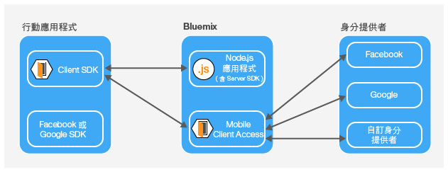
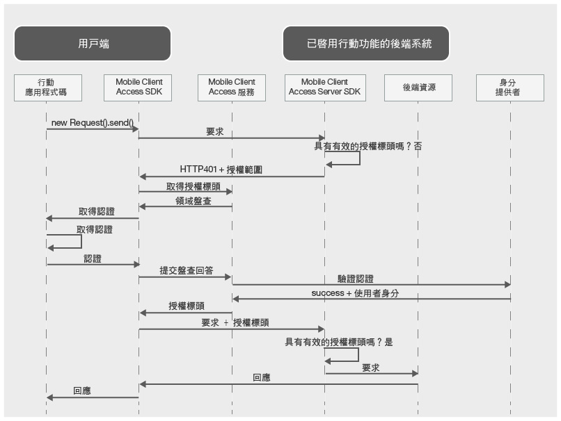

---

copyright:
  years: 2015, 2016

---

# 關於 {{site.data.keyword.amashort}}
{: #mca-overview}
*前次更新：2016 年 5 月 15 日*
{: .last-updated}

{{site.data.keyword.amafull}} 服務針對存取 {{site.data.keyword.Bluemix_notm}} 上所管理雲端資源的行動應用程式，提供鑑別及監視服務。

您可以使用 {{site.data.keyword.amashort}} 服務，透過各種鑑別類型保護 {{site.data.keyword.Bluemix_notm}} 上所管理的 Node.js 及 Liberty for Java&trade; 應用程式。您可以使用 {{site.data.keyword.amashort}} SDK 檢測行動應用程式，以使用 {{site.data.keyword.amashort}} 服務所提供的鑑別功能。會自動收集監視及用戶端日誌資料，並視需求將其傳送給 {{site.data.keyword.amashort}} 服務。請使用 {{site.data.keyword.amashort}} 儀表板來配置各種鑑別類型，以及查看用戶端 SDK 所收集的資料。

**附註**：{{site.data.keyword.amashort}} 服務先前稱為 Advanced Mobile Access。

## {{site.data.keyword.amashort}} 元件
{: #components}

* **{{site.data.keyword.amashort}} 儀表板**：配置各種鑑別類型，以及監視行動應用程式效能、分析、用量統計資料及裝置日誌。
* **{{site.data.keyword.amashort}} 用戶端 SDK**：檢測行動應用程式以使用 {{site.data.keyword.amashort}} 功能。支援的平台如下：iOS 8+、Android 4+、Cordova。
* **{{site.data.keyword.amashort}} 伺服器 SDK**：保護 {{site.data.keyword.Bluemix_notm}} 上所管理的資源。目前支援的運行環境為 Node.js 及 Liberty for Java&trade;。

## 鑑別類型
{: #authtypes}
您可以在行動應用程式中使用下列類型的鑑別：
* **Facebook**：使用 Facebook 作為身分提供者。您的使用者利用 Facebook 認證來登入行動應用程式。
* **Google**：使用 Google 作為身分提供者。您的使用者利用 Google+ 認證來登入行動應用程式。
* **自訂**：建立專屬身分提供者。您可完全控制收集及驗證的資訊類型。

## {{site.data.keyword.amashort}} 架構概觀
{: #architecture}

* 使用 {{site.data.keyword.amashort}} 伺服器 SDK 來保護雲端資源（Node.js 應用程式）。
* 使用 {{site.data.keyword.amashort}} 用戶端 SDK 所提供的 `Request` 類別，以與受保護的雲端資源通訊。
* {{site.data.keyword.amashort}} 伺服器 SDK 會偵測未獲授權的要求，並傳回「HTTP 401 授權」盤查。
* {{site.data.keyword.amashort}} 用戶端 SDK 會偵測「HTTP 401 授權」盤查，並使用 {{site.data.keyword.amashort}} 服務自動啟動鑑別處理程序。
* Facebook、Google 或「自訂」鑑別是用來進行鑑別。
* 成功鑑別之後，{{site.data.keyword.amashort}} 會傳回授權記號。
* {{site.data.keyword.amashort}} 用戶端 SDK 會將授權記號自動新增至原始要求，並將要求重新傳送至雲端資源。
* {{site.data.keyword.amashort}} 伺服器 SDK 會從要求中擷取 accessToken，並向 {{site.data.keyword.amashort}} 服務驗證它。
* 授與存取權。回應會傳回給行動應用程式。

## {{site.data.keyword.amashort}} 要求流程
{: #flow}
下圖說明要求如何從 SDK 流向行動後端應用程式及身分提供者。

1. 使用 {{site.data.keyword.amashort}} SDK，對使用 {{site.data.keyword.amashort}} 伺服器 SDK 所保護的後端資源提出要求。
* {{site.data.keyword.amashort}} 伺服器 SDK 會偵測未獲授權的要求，並傳回 HTTP 401 + 授權範圍。
* {{site.data.keyword.amashort}} 用戶端 SDK 會自動偵測 HTTP 401，並啟動鑑別處理程序。
* {{site.data.keyword.amashort}} 用戶端 SDK 會聯絡 {{site.data.keyword.amashort}} 服務，並要求發出授權標頭。
* {{site.data.keyword.amashort}} 服務會根據目前配置的鑑別類型來提供鑑別盤查，以要求先鑑別用戶端應用程式。
* {{site.data.keyword.amashort}} 用戶端 SDK：
   *  **Facebook 或 Google 鑑別**：自動處理鑑別盤查（用於 Facebook 或 Google 鑑別）
   * **自訂鑑別**：根據開發人員所提供的邏輯來取得認證。
* 如果已配置 Facebook 或 Google 鑑別，則 {{site.data.keyword.amashort}} 用戶端 SDK 會使用相關聯的 SDK 來取得 Facebook 或 Google 存取記號。這些記號會作為鑑別盤查回應。
* 如果已配置「自訂」鑑別，則開發人員必須取得鑑別盤查回答，並將它提供給 {{site.data.keyword.amashort}} 用戶端 SDK。
* 取得鑑別盤查回答之後，它會傳送給 {{site.data.keyword.amashort}} 服務。
* 服務會向個別身分提供者（Facebook/Google/自訂）驗證鑑別盤查回答。
* 如果驗證成功，則 {{site.data.keyword.amashort}} 服務會產生授權標頭，並將標頭傳回給 {{site.data.keyword.amashort}} 用戶端 SDK。授權標頭包含兩個記號：包含存取權資訊的存取記號，以及包含現行使用者、裝置或應用程式相關資訊的 ID 記號。
* 從此時起，使用 {{site.data.keyword.amashort}} 用戶端 SDK 所提出的所有要求都會有新取得的授權標頭。
* {{site.data.keyword.amashort}} 用戶端 SDK 會自動重新傳送已觸發授權流程的原始要求。
* {{site.data.keyword.amashort}} 伺服器 SDK 會從要求中擷取授權標頭、向 {{site.data.keyword.amashort}} 服務驗證授權標頭，以及授與對後端資源的存取權。
