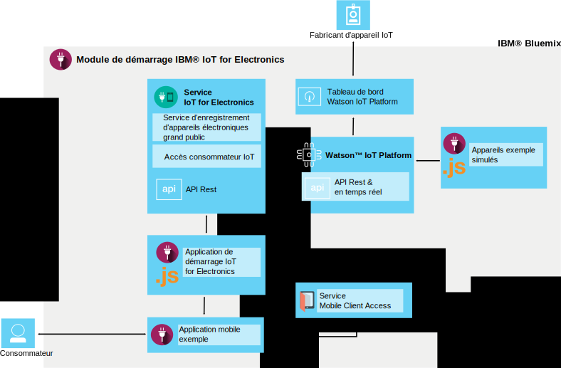

---

copyright:
  years: 2016

---

{:new_window: target="_blank"}
{:shortdesc: .shortdesc}

# A propos de {{site.data.keyword.iotelectronics}}
{: #iotelectronics_about}
*Dernière mise à jour : 11 juin 2016*

{{site.data.keyword.iotelectronics_full}} est une instance de
production IoT entièrement intégrée qui permet à vos applications de
communiquer avec et de consommer des données collectées par vos
appareils connectés, vos capteurs et vos passerelles.
{:shortdesc}

{{site.data.keyword.iotelectronics}} fait appel au service
{{site.data.keyword.iot_full}} pour connecter vos appareils
électroniques intelligents aux applications que vous développez. Il utilise
également {{site.data.keyword.iot_full}} pour faciliter l'analyse et la
compréhension des données issues de vos appareils. Vous pouvez établir des
règles identifiant des conditions nécessitant votre attention et définir des
réponses automatisées, comme l'envoi d'un courrier électronique, l'exécution
d'un flux de travaux Node-RED ou la connexion à des services Web.   

## Recherche du module de démarrage

Le module de démarrage {{site.data.keyword.iotelectronics}} se trouve dans la
[section
Conteneurs boilerplates](https://console.{DomainName}/catalog/starters/iot-for-electronics-starter/) du catalogue {{site.data.keyword.Bluemix_notm}}. 

## Fonctions d'{{site.data.keyword.iotelectronics}}
{: #Features_iote}
Découvrez rapidement les fonctions de la solution
{{site.data.keyword.iotelectronics}} à l'aide d'appareils et de
données simulés. 

### Connectez des appareils simulés
Créez des appareils simulés et connectez-les à la plateforme pour
visualiser des flux de données en continu actifs. Utilisez une application Web
pour simuler la réception de commandes et l'exécution
d'opérations par un appareil. Imitez des échecs pour générer des détections et
des alertes. 

### Essayez une application mobile de consommateur exemple
Utilisez un téléphone iOS pour voir comment le propriétaire d'un
appareil peut interagir avec ce dernier. Envoyez des commandes à l'appareil et
recevez les mises à jour de l'appareil à l'aide de la plateforme
et de {{site.data.keyword.Bluemix_notm}}. Imitez des échecs et affichez
les résultats dans l'application mobile. 

### Connectez vos propres périphériques électroniques
Connectez vos propres périphériques au cloud de manière sécurisée et
commencez à personnaliser vos applications. Nous mettons à votre disposition un
ensemble de recettes et d'exemple vérifiés que vous pouvez modifier et utiliser pour les démonstrations de faisabilité, les tests et l'expérimentation. 

## Contenu du module de démarrage {{site.data.keyword.iotelectronics}}
{: #whatsInStarter}
Le conteneur boilerplate du module de démarrage déploie la solution
{{site.data.keyword.iotelectronics}} intégrée. Tous les composants
sont liés et déployés automatiquement pour vous. Le module de démarrage vous
permet d'explorer rapidement les fonctions de la solution grâce à des
appareils et des données simulés. L'application mobile exemple vous
indique comment un consommateur peut enregistrer et recevoir des alertes, et contrôler un appareil connecté. Vous
pouvez vous servir des exemples comme points de départ pour la création de vos propres applications et collecter des données à partir de vos appareils. Les
applications et services suivants sont inclus dans la solution :

Le **service {{site.data.keyword.iotelectronics}}** prend en charge
l'enregistrement des utilisateurs et des périphériques, ainsi que les notifications.

**{{site.data.keyword.iot_full}}** permet à
vos applications de communiquer avec et des d'utiliser les données collectées
par vos périphériques connectés, vos capteurs et vos passerelles. 

<!-- **{{site.data.keyword.iotrtinsights_full}}** enables you to enrich and monitor data from your devices, visualize what's happening now, and respond to emerging conditions by using automated actions. -->

**{{site.data.keyword.amafull}}** permet aux
utilisateurs des applications mobiles de se connecter avec des comptes sociaux
existants et garantit la sécurité des communications avec les systèmes
dorsaux. 

**{{site.data.keyword.sdk4nodefull}}**
vous permet de développer, déployer et mettre à l'échelle des applications
JavaScript&reg; côté serveur et fournit des performances, une sécurité et une
serviçabilité améliorées.

L'**application mobile exemple** vous permet
d'afficher le statut et de communiquer avec une appareil simulé à l'aide de
votre téléphone iOS. Pour savoir comment obtenir l'application mobile,
cliquez [ici](iotelectronics_config_mobile.html).

# Liens connexes
{: #rellinks}
## Composants
{: #general}
* [{{site.data.keyword.iot_short}}](https://new-console.ng.bluemix.net/docs/services/IoT/index.html#gettingstartedtemplate)
* [{{site.data.keyword.iotrtinsights_short}}](https://new-console.ng.bluemix.net/docs/services/iotrtinsights/index.html)   
* [{{site.data.keyword.amafull}}](https://new-console.ng.bluemix.net/docs/services/mobileaccess/index.html)
* [{{site.data.keyword.sdk4nodefull}}](https://new-console.ng.bluemix.net/docs/runtimes/nodejs/index.html#nodejs_runtime)

## Documentation sur les API
{: #api}
*  [{{site.data.keyword.iotelectronics}}](http://ibmiotforelectronics.mybluemix.net/public/iot4eregistrationapi.html)  
* [{{site.data.keyword.iotrtinsights_short}}](https://iotrti-prod.mam.ibmserviceengage.com/apidoc/)
* [{{site.data.keyword.iot_short}}](https://developer.ibm.com/iotfoundation/recipes/api-documentation/)
